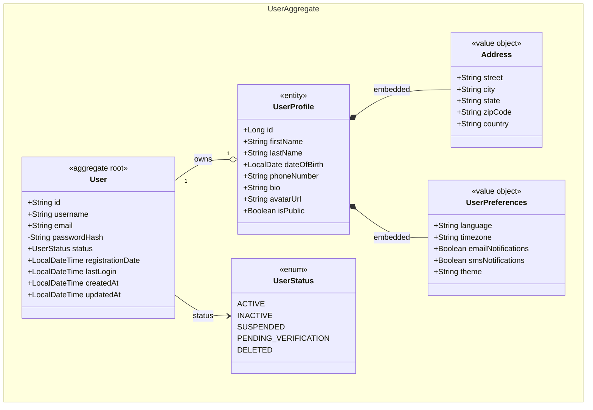

# Características Futuras - eva4j

Este documento describe las mejoras planificadas para futuras versiones de eva4j, organizadas por prioridad. Cada sección incluye el contexto DDD correspondiente, la sintaxis YAML propuesta y ejemplos del código que se generaría.

---

## � Tabla de Contenidos

### � Alta Prioridad
- [Domain Events](#1-domain-events) ✅
- [Aggregate Boundaries por ID](#2-aggregate-boundaries-por-id) ✅
- [Soft Delete Completo](#3-soft-delete-completo) ✅
- [Transactional Outbox Pattern](#15-transactional-outbox-pattern)

### � Media Prioridad
- [Paginación en Queries](#4-paginación-en-queries) ✅
- [Optimistic Locking](#5-optimistic-locking)
- [Read Models Separados](#6-read-models-separados-proyecciones)
- [Enums con Comportamiento y Transiciones](#7-enums-con-comportamiento-y-transiciones) ✅
- [Políticas y Especificaciones](#8-políticas-y-especificaciones)

### � Tooling y Calidad
- [Validación de domain.yaml con JSON Schema](#9-validación-de-domainyaml-con-json-schema)
- [Generación Incremental / Diff](#10-generación-incremental--diff) ✅
- [Comando eva4j doctor](#11-comando-eva4j-doctor)
- [Tests Generados Completos](#12-tests-generados-completos)
- [Diagrama Mermaid desde domain.yaml](#13-diagrama-mermaid-desde-domainyaml-eva-g-diagram)

### 🚀 Prototyping
- [Mock Mode — `eva build --mock`](#17-mock-mode--eva-build---mock) ✅

### ✅ Implementado
- [Domain Events](#1-domain-events)
- [Aggregate Boundaries por ID](#2-aggregate-boundaries-por-id)
- [Soft Delete Completo](#3-soft-delete-completo)
- [Paginación en Queries](#4-paginación-en-queries)
- [Enums con Comportamiento y Transiciones](#7-enums-con-comportamiento-y-transiciones)
- [Generación Incremental / Diff](#10-generación-incremental--diff)
- [Auditoría de Tiempo y Usuario](#15-auditoría-implementada)
- [Validaciones JSR-303](#14-validaciones-jsr-303-implementado)
- [`defaultValue` para campos `readOnly`](#16-defaultvalue-para-campos-readonly-implementado)
- [Mock Mode (`eva build --mock`)](#17-mock-mode--eva-build---mock)

---

## � ALTA PRIORIDAD

---

## 1. Domain Events ✅

### Descripción

Los **Domain Events** son el patrón más fundamental de DDD que actualmente falta en eva4j. Un evento de dominio representa algo significativo que ocurrió en el negocio — un hecho pasado, no una intención futura. Son esenciales para:

- Comunicar cambios entre agregados sin acoplamiento directo
- Disparar side effects (emails, notificaciones, actualizaciones de proyecciones)
- Construir sistemas eventualmente consistentes

Sin eventos de dominio, la comunicación entre agregados obliga a dependencias directas que violan los límites de los bounded contexts.

### Sintaxis Propuesta en domain.yaml

```yaml
aggregates:
  - name: Order
    entities:
      - name: order
        isRoot: true
        events:
          - name: OrderPlaced
            fields:
              - name: orderId
                type: String
              - name: customerId
                type: String
              - name: totalAmount
                type: BigDecimal
          - name: OrderCancelled
            fields:
              - name: orderId
                type: String
              - name: reason
                type: String
```

### Código Generado

#### Clase base DomainEvent

```java
// shared/domain/DomainEvent.java
public abstract class DomainEvent {
    private final String eventId;
    private final LocalDateTime occurredOn;
    private final String aggregateId;

    protected DomainEvent(String aggregateId) {
        this.eventId = UUID.randomUUID().toString();
        this.occurredOn = LocalDateTime.now();
        this.aggregateId = aggregateId;
    }

    public String getEventId() { return eventId; }
    public LocalDateTime getOccurredOn() { return occurredOn; }
    public String getAggregateId() { return aggregateId; }
}
```

#### Evento específico generado

```java
// domain/models/events/OrderPlacedEvent.java
public class OrderPlacedEvent extends DomainEvent {
    private final String customerId;
    private final BigDecimal totalAmount;

    public OrderPlacedEvent(String orderId, String customerId, BigDecimal totalAmount) {
        super(orderId);
        this.customerId = customerId;
        this.totalAmount = totalAmount;
    }

    public String getCustomerId() { return customerId; }
    public BigDecimal getTotalAmount() { return totalAmount; }
}
```

#### Raíz del agregado con eventos

```java
// domain/models/entities/Order.java
public class Order {
    private List<DomainEvent> domainEvents = new ArrayList<>();

    public List<DomainEvent> getDomainEvents() {
        return Collections.unmodifiableList(domainEvents);
    }

    public void clearDomainEvents() {
        domainEvents.clear();
    }

    public void place(String customerId, BigDecimal total) {
        this.status = OrderStatus.PLACED;
        domainEvents.add(new OrderPlacedEvent(this.id, customerId, total));
    }

    public void cancel(String reason) {
        if (this.status == OrderStatus.DELIVERED) {
            throw new IllegalStateException("Cannot cancel a delivered order");
        }
        this.status = OrderStatus.CANCELLED;
        domainEvents.add(new OrderCancelledEvent(this.id, reason));
    }
}
```

#### Publicación automática desde el repositorio

```java
@Override
public Order save(Order order) {
    OrderJpa jpa = mapper.toJpa(order);
    repository.save(jpa);
    order.getDomainEvents().forEach(eventPublisher::publishEvent);
    order.clearDomainEvents();
    return mapper.toDomain(jpa);
}
```

#### Listener en otro módulo (sin acoplamiento)

```java
@Component
public class OrderEventListener {
    @EventListener
    public void onOrderPlaced(OrderPlacedEvent event) {
        // enviar email de confirmación, actualizar inventario, etc.
    }

    @TransactionalEventListener(phase = AFTER_COMMIT)
    public void onOrderCancelled(OrderCancelledEvent event) {
        // proceso de reembolso, notificación al cliente
    }
}
```

---

## 2. Aggregate Boundaries por ID ✅

### Descripción

Eva4j ya genera correctamente el patrón DDD de referencia por ID: los campos que apuntan a otro agregado se generan como tipos primitivos (`String`, `Long`, etc.) sin ningún `@ManyToOne` cruzado. Esta feature añade **declaración semántica explícita** mediante la propiedad `reference:` en el campo, que permite documentar la intención en el YAML y generar un comentario Javadoc en el código.

Sin `reference:`, un campo `customerId: String` es indistinguible de cualquier otro `String`. Con `reference:`, el generador sabe que es un puntero intencional al agregado `Customer` del módulo `customers`.

### Sintaxis

```yaml
aggregates:
  - name: Order
    entities:
      - name: order
        isRoot: true
        fields:
          - name: id
            type: String
          - name: customerId
            type: String
            reference:
              aggregate: Customer   # Nombre del agregado (PascalCase) — obligatorio
              module: customers     # Módulo donde vive el agregado — opcional
          - name: productId
            type: String
            reference:
              aggregate: Product
              module: catalog
```

### Comportamiento

- El tipo Java **no cambia** — sigue siendo `String`, `Long`, etc.
- JPA genera `@Column` normal — **sin** `@ManyToOne` ni `@JoinColumn`.
- Se genera un **comentario Javadoc** en la entidad de dominio y en la entidad JPA.
- `module:` es opcional: se puede omitir si el agregado referenciado está en el mismo módulo.
- Si `reference:` está malformado (falta `aggregate`), eva4j lanza un error descriptivo.

### Código Generado

```java
// domain/models/entities/Order.java
/** Cross-aggregate reference → Customer (module: customers) */
private String customerId;

/** Cross-aggregate reference → Product (module: catalog) */
private String productId;
```

```java
// infrastructure/database/entities/OrderJpa.java
@Column(name = "customer_id")
/** Cross-aggregate reference → Customer (module: customers) */
private String customerId;

@Column(name = "product_id")
/** Cross-aggregate reference → Product (module: catalog) */
private String productId;
```

### Archivos Modificados

| Archivo | Cambio |
|---|---|
| `src/utils/yaml-to-entity.js` | ✅ Destructura y valida `reference:` en `parseProperty()` |
| `templates/aggregate/AggregateRoot.java.ejs` | ✅ Genera comentario Javadoc en campos con `reference` |
| `templates/aggregate/JpaAggregateRoot.java.ejs` | ✅ Genera comentario Javadoc en campos con `reference` |
| `templates/aggregate/JpaEntity.java.ejs` | ✅ Genera comentario Javadoc en campos con `reference` |
| `examples/domain-multi-aggregate.yaml` | ✅ Actualizado con `reference:` en `productId` y `warehouseId` |

---

## 3. Soft Delete Completo ✅

### Descripción

Implementado como `hasSoftDelete: true` en la entidad raíz del agregado. El generador inyecta automáticamente el campo `deletedAt`, añade `@SQLRestriction("deleted_at IS NULL")` en la entidad JPA para filtrar eliminados en todas las queries, genera `softDelete()` e `isDeleted()` en el dominio, y cambia el `DeleteCommandHandler` a borrado lógico.

### Sintaxis

```yaml
entities:
  - name: product
    isRoot: true
    tableName: products
    hasSoftDelete: true
    audit:
      enabled: true
    fields:
      - name: id
        type: String
      - name: name
        type: String
      - name: price
        type: BigDecimal
```

### Archivos Modificados

| Archivo | Cambio |
|---|---|
| `src/utils/yaml-to-entity.js` | ✅ Parsea `hasSoftDelete`, inyecta `deletedAt` en campo de entidad |
| `src/commands/generate-entities.js` | ✅ Propaga `hasSoftDelete` a todos los contextos, excluye `deletedAt` de comandos/respuestas |
| `templates/aggregate/AggregateRoot.java.ejs` | ✅ Excluye `deletedAt` del constructor de creación, genera `softDelete()` e `isDeleted()` |
| `templates/aggregate/JpaAggregateRoot.java.ejs` | ✅ Añade `@SQLRestriction("deleted_at IS NULL")` e import condicional |
| `templates/aggregate/AggregateRepository.java.ejs` | ✅ Elimina `deleteById()` del puerto cuando hay soft delete |
| `templates/aggregate/AggregateRepositoryImpl.java.ejs` | ✅ Mismo cambio en la implementación |
| `templates/crud/DeleteCommandHandler.java.ejs` | ✅ Dos ramas: `findById→softDelete()→save()` vs `deleteById()` |
| `examples/domain-soft-delete.yaml` | ✅ Reescrito con sintaxis `hasSoftDelete: true` |

### Comportamiento generado

- `deletedAt` inyectado automáticamente — no declarar a mano en `fields:`
- `deletedAt` excluido de `CreateCommand`, `ResponseDto` (invisible en API)
- `GET /products` y `GET /products/{id}` nunca retornan registros eliminados
- `DELETE /products/{id}` sobre un registro ya eliminado retorna 404
- `deleteById()` eliminado del contrato del repositorio

### Scope excluido

- Endpoint de restauración (`PATCH /{id}/restore`) — pendiente de implementar como use case adicional
- Query param `includeDeleted=true` — requiere query nativa separada

---

## � MEDIA PRIORIDAD

---

## 4. Paginación en Queries ✅

### Descripción

Implementado como **paginación siempre activa** en todos los módulos generados. `GET /` ya no devuelve `List<T>` sin límite — devuelve un `PagedResponse<T>` propio con `content`, `page`, `size`, `totalElements` y `totalPages`. Sin flags ni configuración adicional en `domain.yaml`.

### Implementación Realizada

#### PagedResponse — `shared/application/dtos/PagedResponse.java`

Record genérico generado una vez por proyecto en la capa shared. Desacoplado de Spring Data `Page<T>` para no exponer internals de Spring en la API:

```java
public record PagedResponse<T>(
    List<T> content,
    int page,
    int size,
    long totalElements,
    int totalPages
) {
    public static <T> PagedResponse<T> of(
            List<T> content, int page, int size, long totalElements) {
        int totalPages = size == 0 ? 1 : (int) Math.ceil((double) totalElements / size);
        return new PagedResponse<>(content, page, size, totalElements, totalPages);
    }
}
```

#### Query con parámetros de paginación

```java
public record FindAllOrdersQuery(
    int page,
    int size,
    String sortBy,
    String sortDirection
) implements Query<PagedResponse<OrderResponseDto>> {}
```

#### Handler paginado

```java
public PagedResponse<OrderResponseDto> handle(FindAllOrdersQuery query) {
    Sort sort = Sort.by(Sort.Direction.fromString(query.sortDirection()), query.sortBy());
    Pageable pageable = PageRequest.of(query.page(), query.size(), sort);
    Page<Order> page = repository.findAll(pageable);
    List<OrderResponseDto> content = page.getContent().stream().map(mapper::toDto).toList();
    return PagedResponse.of(content, page.getNumber(), page.getSize(), page.getTotalElements());
}
```

#### Endpoint REST

```bash
# Defaults: page=0, size=20, sortBy=id, sortDirection=ASC
GET /api/v1/orders?page=0&size=10&sortBy=createdAt&sortDirection=DESC

# Respuesta
{
  "content": [...],
  "page": 0,
  "size": 10,
  "totalElements": 87,
  "totalPages": 9
}
```

#### Archivos modificados

| Archivo | Cambio |
|---|---|
| `templates/shared/application/dtos/PagedResponse.java.ejs` | ✅ Nuevo template shared |
| `src/generators/shared-generator.js` | ✅ Método `generatePagedResponse()` |
| `src/commands/generate-entities.js` | ✅ Llama `generatePagedResponse` en cada `g entities` |
| `templates/crud/ListQuery.java.ejs` | ✅ Parámetros de paginación |
| `templates/crud/ListQueryHandler.java.ejs` | ✅ `PageRequest` + `PagedResponse` |
| `templates/aggregate/AggregateRepository.java.ejs` | ✅ `Page<X> findAll(Pageable)` |
| `templates/aggregate/AggregateRepositoryImpl.java.ejs` | ✅ Implementación `jpaRepository.findAll(pageable).map(...)` |
| `templates/crud/Controller.java.ejs` | ✅ `@RequestParam` page/size/sortBy/sortDirection |

---

## 5. Optimistic Locking

### Descripción

El **Optimistic Locking** previene la pérdida de actualizaciones cuando dos usuarios modifican el mismo registro simultáneamente. Sin él, la última escritura gana sin advertencia, causando pérdida de datos silenciosa.

### Sintaxis Propuesta

```yaml
entities:
  - name: account
    isRoot: true
    audit:
      enabled: true
      optimisticLocking: true
    fields:
      - name: id
        type: String
      - name: balance
        type: BigDecimal
```

### Código Generado

```java
@Entity
public class AccountJpa extends AuditableEntity {
    @Id
    private String id;

    @Column(name = "balance")
    private BigDecimal balance;

    @Version
    @Column(name = "version", nullable = false)
    private Long version;
}
```

```java
// El UpdateCommand incluye la versión esperada
public record UpdateAccountCommand(
    String id,
    BigDecimal newBalance,
    Long version    // Si no coincide con la BD: HTTP 409 Conflict
) {}
```

```java
// ControllerAdvice generado
@ExceptionHandler(ObjectOptimisticLockingFailureException.class)
public ResponseEntity<ErrorDto> handleOptimisticLock(ObjectOptimisticLockingFailureException ex) {
    return ResponseEntity.status(HttpStatus.CONFLICT)
        .body(new ErrorDto("CONFLICT", "The record was modified by another user. Please reload and retry."));
}
```

---

## 6. Read Models Separados (Proyecciones) ✅

> **Implementado en v1.0.15** — Sección `readModels:` en `domain.yaml` con generación automática de proyecciones locales mantenidas por eventos Kafka. Ver [`DOMAIN_YAML_GUIDE.md`](DOMAIN_YAML_GUIDE.md#sección-readmodels) y [`read-model-spec.md`](read-model-spec.md).

### Descripción

Proyecciones locales de datos de otro bounded context, mantenidas mediante eventos de dominio. Elimina dependencias síncronas (HTTP) entre módulos.

### Sintaxis Implementada

```yaml
readModels:
  - name: ProductReadModel
    source:
      module: products
      aggregate: Product
    tableName: rm_products
    fields:
      - name: id
        type: String
      - name: name
        type: String
      - name: price
        type: BigDecimal
    syncedBy:
      - event: ProductCreatedEvent
        action: UPSERT
      - event: ProductUpdatedEvent
        action: UPSERT
      - event: ProductDeactivatedEvent
        action: SOFT_DELETE
```

### Artefactos Generados

- Clase de dominio inmutable (`domain/models/readmodels/`)
- Entidad JPA sin auditoría (`infrastructure/database/entities/`)
- Repositorio (interfaz + impl)
- Sync handler con un método por evento
- Kafka listeners (uno por entry en `syncedBy`)
- Integration Events (reutilizados si ya existen)

---

## 7. Enums con Comportamiento y Transiciones ✅

### Descripción

Los enums generados actualmente son solo listas de valores. En DDD, los enums frecuentemente encapsulan lógica de transición de estado — qué valores son válidos como siguiente estado, qué acciones se permiten. Esto elimina `if/switch` dispersos en el dominio.

### Sintaxis Propuesta

```yaml
enums:
  - name: OrderStatus
    withTransitions: true
    values:
      - DRAFT
      - PLACED
      - CONFIRMED
      - SHIPPED
      - DELIVERED
      - CANCELLED
    transitions:
      DRAFT:      [PLACED, CANCELLED]
      PLACED:     [CONFIRMED, CANCELLED]
      CONFIRMED:  [SHIPPED, CANCELLED]
      SHIPPED:    [DELIVERED]
      DELIVERED:  []
      CANCELLED:  []
```

### Código Generado

```java
public enum OrderStatus {
    DRAFT(Set.of("PLACED", "CANCELLED")),
    PLACED(Set.of("CONFIRMED", "CANCELLED")),
    CONFIRMED(Set.of("SHIPPED", "CANCELLED")),
    SHIPPED(Set.of("DELIVERED")),
    DELIVERED(Set.of()),
    CANCELLED(Set.of());

    private final Set<String> allowedTransitions;

    OrderStatus(Set<String> allowedTransitions) {
        this.allowedTransitions = allowedTransitions;
    }

    public boolean canTransitionTo(OrderStatus next) {
        return allowedTransitions.contains(next.name());
    }

    public void validateTransitionTo(OrderStatus next) {
        if (!canTransitionTo(next)) {
            throw new IllegalStateException(
                String.format("Cannot transition from %s to %s", this.name(), next.name())
            );
        }
    }
}
```

```java
// Uso en entidad de dominio — declarativo, sin if/switch
public void confirm() {
    this.status.validateTransitionTo(OrderStatus.CONFIRMED);
    this.status = OrderStatus.CONFIRMED;
}

public void ship() {
    this.status.validateTransitionTo(OrderStatus.SHIPPED);
    this.status = OrderStatus.SHIPPED;
}
```

---

## 8. Políticas y Especificaciones

### Descripción

El **Specification Pattern** encapsula reglas de negocio complejas como objetos combinables. Es especialmente útil cuando las mismas reglas se aplican en múltiples lugares: validación al crear, filtrado en queries, reportes. Actualmente eva4j no genera ninguna infraestructura para este patrón.

### Sintaxis Propuesta

```yaml
aggregates:
  - name: Order
    specifications:
      - name: OrderCanBeShipped
        description: "Una orden puede enviarse si está confirmada y tiene dirección de envío"
      - name: OrderIsOverdue
        description: "Una orden está vencida si lleva más de 30 días en estado PLACED"
```

### Código Generado

```java
public interface Specification<T> {
    boolean isSatisfiedBy(T candidate);

    default Specification<T> and(Specification<T> other) {
        return candidate -> this.isSatisfiedBy(candidate) && other.isSatisfiedBy(candidate);
    }

    default Specification<T> or(Specification<T> other) {
        return candidate -> this.isSatisfiedBy(candidate) || other.isSatisfiedBy(candidate);
    }

    default Specification<T> not() {
        return candidate -> !this.isSatisfiedBy(candidate);
    }
}
```

```java
@Component
public class OrderCanBeShippedSpecification implements Specification<Order> {
    @Override
    public boolean isSatisfiedBy(Order order) {
        return order.getStatus() == OrderStatus.CONFIRMED
            && order.getShippingAddress() != null;
    }
}
```

```java
@Component
public class ShipOrderCommandHandler {
    private final OrderCanBeShippedSpecification canBeShipped;

    public void handle(ShipOrderCommand command) {
        Order order = orderRepository.findById(command.orderId()).orElseThrow();
        if (!canBeShipped.isSatisfiedBy(order)) {
            throw new OrderCannotBeShippedException(command.orderId());
        }
        order.ship();
        orderRepository.save(order);
    }
}
```

---

## � TOOLING Y CALIDAD

---

## 9. Validación de domain.yaml con JSON Schema

### Descripción

Actualmente los errores en `domain.yaml` producen mensajes crípticos de Node.js en tiempo de ejecución. Un JSON Schema publicado permitiría validación inmediata en el editor (VS Code, IntelliJ) antes de ejecutar `eva4j g entities`, con autocompletado y documentación inline.

### Comportamiento Esperado

Con el schema configurado, el editor mostraría errores como:

```
domain.yaml:14:5  error  Property "tipe" is not allowed. Did you mean "type"?
domain.yaml:28:9  error  "audit.trackUser" requires "audit.enabled: true"
domain.yaml:41:7  error  Relationship type "OneToFew" is not valid.
                         Expected one of: OneToOne, OneToMany, ManyToOne, ManyToMany
```

### Implementación

```json
{
  "": "http://json-schema.org/draft-07/schema#",
  "title": "eva4j domain.yaml",
  "type": "object",
  "required": ["aggregates"],
  "properties": {
    "aggregates": {
      "type": "array",
      "items": {
        "required": ["name", "entities"],
        "properties": {
          "name": { "type": "string", "pattern": "^[A-Z][a-zA-Z0-9]*$" },
          "entities": { "type": "array" }
        },
        "additionalProperties": false
      }
    }
  }
}
```

```json
// .vscode/settings.json (generado por eva4j create)
{
  "yaml.schemas": {
    "https://eva4j.dev/schemas/domain-yaml.json": "domain.yaml"
  }
}
```

---

## 10. Generación Incremental / Diff ✅

### Descripción

Implementado como **safe mode con checksums SHA-256**. `eva4j g entities` (y `g usecase`, `g resource`) detecta si un archivo generado fue modificado manualmente después de su generación y lo omite automáticamente en re-ejecuciones. El flag `--force` permite sobreescribir cuando se desea regenerar intencionalmente.

### Implementación Realizada

#### ChecksumManager — `src/utils/checksum-manager.js`

Almacena hashes SHA-256 de cada archivo escrito en un archivo `.eva4j-checksums.json` por módulo (junto al `domain.yaml`). Métodos clave:
- `wasModified(destPath, generatedContent)` — compara hash en disco vs hash almacenado
- `recordWrite(destPath, content)` — registra hash del archivo recién escrito
- `save()` — persiste la base de datos de checksums

#### Safe mode en `renderAndWrite()` — `src/utils/template-engine.js`

```bash
# Comportamiento por defecto (safe mode)
eva4j g entities orders

# Output:
# ✅ Order.java                        -- regenerado (sin cambios previos)
# ✅ OrderJpa.java                     -- regenerado (sin cambios previos)
# ⚠️  SKIP OrderApplicationMapper.java -- omitido (modificado manualmente — use --force to overwrite)
# ⚠️  SKIP CreateOrderCommandHandler.java -- omitido (modificado manualmente)

# Con --force: sobreescribe todo
eva4j g entities orders --force
```

#### Comandos con safe mode integrado

| Comando | Estado |
|---|---|
| `eva4j g entities <module>` | ✅ Integrado |
| `eva4j g usecase <module> <name>` | ✅ Integrado |
| `eva4j g resource <module>` | ✅ Integrado |
| `eva4j create` / `eva4j add module` | ⚠️ Out of scope (archivos de scaffolding inicial, no se re-ejecutan) |

#### Nota sobre portabilidad

`.eva4j-checksums.json` está en `.gitignore` por diseño — es estado local de la máquina de desarrollo. En un `git clone` fresco, la primera re-ejecución regenerará todos los archivos (comportamiento correcto en ese contexto).

---

## 11. Comando `eva4j doctor`

### Descripción

Un comando de análisis estático que examina el código del proyecto y detecta violaciones de los patrones DDD que eva4j promueve. Útil para onboarding de equipos y revisiones de arquitectura.

### Uso

```bash
eva4j doctor
eva4j doctor --module orders
eva4j doctor --verbose
```

### Salida Esperada

```
� eva4j doctor — Analizando proyecto...

� Módulo: orders

  ❌ Order.java:45
     Setter público detectado: setStatus(OrderStatus status)
     Recomendación: Reemplazar con método de negocio: confirm(), cancel(), etc.

  ❌ OrderItemJpa.java:12
     Falta @JoinColumn en relación inverse @ManyToOne
     Recomendación: Agregar @JoinColumn(name = "order_id", nullable = false)

  ⚠️  CreateOrderCommandHandler.java:67
     Lógica de negocio detectada fuera del dominio: totalAmount > 0
     Recomendación: Mover validación a Order.place() como invariante de dominio

  ✅ OrderRepository.java — OK
  ✅ OrderMapper.java — OK

� Resultado: 2 errores, 1 advertencia, 2 archivos OK
```

### Reglas Implementadas

| Regla | Severidad | Descripción |
|---|---|---|
| No setters en dominio | ❌ Error | Detecta `set*` públicos en entidades de dominio |
| No constructor vacío en dominio | ❌ Error | Detecta `public Entity()` sin parámetros |
| Repositorio solo para raíz | ❌ Error | Detecta `Repository<SecondaryEntity>` |
| FK cross-aggregate | ⚠️ Warn | `@ManyToOne` a entidad de otro agregado |
| Lógica de negocio en handler | ⚠️ Warn | Condicionales complejos en CommandHandlers |
| Value Object mutable | ⚠️ Warn | Value Objects con setters o campos non-final |

---

## 12. Tests Generados Completos

### Descripción

Actualmente eva4j genera estructura de test básica. Para proyectos en producción, los tests deben cubrir invariantes de dominio, contrato de mappers y tests de integración de módulo con Spring Modulith.

### Tests de Dominio Generados

```java
class OrderTest {

    @Test
    @DisplayName("Should create order with valid data")
    void shouldCreateOrder() {
        Order order = new Order("ORD-001", "CUST-123");
        assertThat(order.getOrderNumber()).isEqualTo("ORD-001");
        assertThat(order.getStatus()).isEqualTo(OrderStatus.DRAFT);
    }

    @Test
    @DisplayName("Should not allow adding item to cancelled order")
    void shouldRejectItemOnCancelledOrder() {
        Order order = new Order("ORD-001", "CUST-123");
        order.cancel("Test");
        assertThatThrownBy(() -> order.addItem("PROD-1", 2, BigDecimal.TEN))
            .isInstanceOf(IllegalStateException.class)
            .hasMessageContaining("cancelled");
    }
}
```

### Tests de Mapper (roundtrip)

```java
class OrderMapperTest {
    private final OrderMapper mapper = new OrderMapper();

    @Test
    @DisplayName("Domain -> JPA -> Domain roundtrip preserves all fields")
    void domainToJpaRoundtrip() {
        Order original = new Order("id-1", "ORD-001", "CUST-123",
            OrderStatus.DRAFT, LocalDateTime.now(), LocalDateTime.now());
        OrderJpa jpa = mapper.toJpa(original);
        Order restored = mapper.toDomain(jpa);
        assertThat(restored.getId()).isEqualTo(original.getId());
        assertThat(restored.getStatus()).isEqualTo(original.getStatus());
    }
}
```

### Tests de Módulo con Spring Modulith

```java
@ApplicationModuleTest
class OrderModuleTest {

    @Test
    @DisplayName("Module is self-contained -- no illegal cross-module dependencies")
    void moduleShouldBeValid(ApplicationModules modules) {
        modules.verify();
    }

    @Test
    @DisplayName("Create order publishes OrderPlacedEvent")
    @Transactional
    void shouldPublishOrderPlacedEvent(
        @Autowired CreateOrderCommandHandler handler,
        AssertablePublishedEvents events
    ) {
        handler.handle(new CreateOrderCommand("ORD-001", "CUST-123"));
        events.assertThat()
            .contains(OrderPlacedEvent.class)
            .matching(e -> e.getAggregateId().equals("ORD-001"));
    }
}
```

---

## 13. Diagrama Mermaid desde domain.yaml (`eva g diagram`)

### Descripción

Generar automáticamente un diagrama **Mermaid `classDiagram`** a partir del `domain.yaml` de un módulo. El diagrama plasma visualmente la estructura del agregado: entidades, value objects, enums, relaciones y visibilidad de campos, usando estereotipos DDD.

El output es un archivo `.md` con el diagrama incrustado, renderizable nativamente en GitHub, VS Code (Markdown Preview), Notion y el reporte HTML de `eva evaluate system`.

### Comando propuesto

```bash
eva generate diagram <module>
eva g diagram <module>          # alias corto
```

### Ejemplo de output para `domain-one-to-one.yaml`



### Reglas de generación

| Elemento domain.yaml | Stereotipo Mermaid | Visibilidad de campos |
|---|---|---|
| `isRoot: true` | `<<aggregate root>>` | `+` público, `-` hidden |
| Entidad secundaria | `<<entity>>` | igual |
| `valueObjects[]` | `<<value object>>` | `+` todos |
| `enums[]` | `<<enum>>` | valores como líneas |
| `audit.enabled: true` | campos `createdAt`, `updatedAt` en la entidad | auto-añadidos |
| `audit.trackUser: true` | campos `createdBy`, `updatedBy` en la entidad | auto-añadidos |
| `hidden: true` | prefijo `-` (privado) en lugar de `+` | |
| `readOnly: true` | prefijo `~` (package) para indicar derivado | |

### Variante HTML (integración con `eva evaluate system`)

Otra opción es agregar un 5.º tab **"Dominio"** al reporte de `evaluate system` que renderice el diagrama Mermaid de cada módulo usando la librería [mermaid.js CDN](https://cdn.jsdelivr.net/npm/mermaid/dist/mermaid.min.js), sin necesidad de un comando separado.

### Estado

✅ Implementado

---

## ✅ IMPLEMENTADO

---

## 15. Auditoría (Implementada)

| Característica | Sintaxis | Estado |
|---|---|---|
| Auditoría de tiempo | `audit: { enabled: true }` | ✅ Implementado |
| Auditoría de usuario | `audit: { trackUser: true }` | ✅ Implementado |
| `@EnableJpaAuditing` condicional | `auditorAwareRef` solo si `trackUser: true` | ✅ Implementado |
| Regeneración de `Application.java` en `g entities` | Automático | ✅ Implementado |

Cuando `trackUser: true` se generan automáticamente: `UserContextFilter`, `UserContextHolder`, `AuditorAwareImpl` y la anotación `@EnableJpaAuditing(auditorAwareRef = "auditorProvider")` en `Application.java`.

Cuando solo `enabled: true` se genera `@EnableJpaAuditing` sin `auditorAwareRef`.

---

## 14. Validaciones JSR-303 (Implementado)

Generación automática de anotaciones Bean Validation en `Create*Command` y `Create*Dto`. Las validaciones **nunca** se generan en entidades de dominio ni en campos `readOnly: true`.

### Sintaxis

```yaml
fields:
  - name: email
    type: String
    validations:
      - type: Email
        message: "Email inválido"
      - type: NotBlank
  - name: age
    type: Integer
    validations:
      - type: Min
        value: 18
      - type: Max
        value: 120
```

### Código Generado

```java
@Email(message = "Email inválido")
@NotBlank
private String email;

@Min(value = 18)
@Max(value = 120)
private Integer age;
```

---

## 16. `defaultValue` para campos `readOnly` (Implementado)

Permite especificar un valor inicial para campos `readOnly` directamente en `domain.yaml`. El valor se emite en el **constructor de creación** de la entidad de dominio y como field initializer con `@Builder.Default` en la entidad JPA.

### Sintaxis

```yaml
entities:
  - name: order
    fields:
      - name: status
        type: OrderStatus
        readOnly: true
        defaultValue: PENDING          # Enum value
      
      - name: totalAmount
        type: BigDecimal
        readOnly: true
        defaultValue: "0.00"           # BigDecimal literal
      
      - name: itemCount
        type: Integer
        readOnly: true
        defaultValue: 0                # Integer literal
      
      - name: isActive
        type: Boolean
        readOnly: true
        defaultValue: true             # Boolean literal
```

### Código Generado — Dominio

```java
// Constructor de creación — defaultValue asignado automáticamente
public Order(String orderNumber, String customerId) {
    this.orderNumber = orderNumber;
    this.customerId = customerId;
    // readOnly fields initialized with defaultValue:
    this.status = OrderStatus.PENDING;
    this.totalAmount = new BigDecimal("0.00");
    this.itemCount = 0;
    this.isActive = true;
}
```

### Código Generado — JPA

```java
@Builder.Default
private OrderStatus status = OrderStatus.PENDING;

@Builder.Default
private BigDecimal totalAmount = new BigDecimal("0.00");

@Builder.Default
private Integer itemCount = 0;
```

### Tipos soportados

| Tipo Java | Ejemplo YAML | Java emitido |
|-----------|-------------|---------------|
| `String` | `defaultValue: hello` | `"hello"` |
| `Integer` / `Long` | `defaultValue: 0` | `0` / `0L` |
| `Boolean` | `defaultValue: false` | `false` |
| `BigDecimal` | `defaultValue: "0.00"` | `new BigDecimal("0.00")` |
| `LocalDateTime` | `defaultValue: now` | `LocalDateTime.now()` |
| `LocalDate` | `defaultValue: now` | `LocalDate.now()` |
| `Instant` | `defaultValue: now` | `Instant.now()` |
| `UUID` | `defaultValue: random` | `UUID.randomUUID()` |
| Enum | `defaultValue: ACTIVE` | `EnumType.ACTIVE` |

### Reglas

- `defaultValue` **solo es válido** en campos con `readOnly: true`. Si se usa en un campo no-readOnly, se emite un warning y se ignora.
- El campo **sigue siendo readOnly** — no aparece en el constructor de negocio ni en `CreateDto`.
- En campos con `autoInit` (enum con `initialValue`), `defaultValue` es ignorado — `autoInit` tiene precedencia.

### Archivos Modificados

| Archivo | Cambio |
|---|---|
| `src/utils/yaml-to-entity.js` | ✅ `computeJavaDefaultValue()` + `defaultValue` en `parseProperty()` |
| `templates/aggregate/AggregateRoot.java.ejs` | ✅ Emite `this.field = defaultValue` en constructor de creación |
| `templates/aggregate/DomainEntity.java.ejs` | ✅ Mismo cambio para entidades secundarias |
| `templates/aggregate/JpaAggregateRoot.java.ejs` | ✅ `@Builder.Default` + field initializer |
| `templates/aggregate/JpaEntity.java.ejs` | ✅ Mismo cambio para entidades JPA secundarias |
| `examples/domain-field-visibility.yaml` | ✅ Ejemplos con `defaultValue` en campos readOnly |

---

## 15. Transactional Outbox Pattern

### Descripción

El **Transactional Outbox Pattern** es la evolución natural de los Domain Events implementados (ítem 1). Resuelve el caso donde el proceso muere después del commit de BD pero antes de que `ApplicationEventPublisher` llegue a publicar al broker externo — en ese escenario, el evento se pierde silenciosamente.

El patrón garantiza **at-least-once delivery**: los eventos son almacenados en la misma transacción que el agregado y un proceso separado los publica de forma resiliente.

Los Domain Events ya implementados (`ApplicationEventPublisher` + `@TransactionalEventListener(AFTER_COMMIT)`) son suficientes para la mayoría de sistemas. Esta feature es necesaria para dominios críticos: pagos, auditoría regulatoria, inventario en tiempo real.

**Nota:** El puerto `MessageBroker` ya generado no requiere cambios — solo se añade la capa de persistencia intermedia.

### Flujo del Patrón

```
BD Transaction:
  → INSERT INTO orders ...
  → INSERT INTO outbox_events (type, payload, published=false)  ← misma TX
  → COMMIT

Proceso resiliente (polling o CDC con Debezium):
  → SELECT * FROM outbox_events WHERE published = false
  → Publica a Kafka / RabbitMQ / SNS
  → UPDATE outbox_events SET published = true
```

### Sintaxis Propuesta en domain.yaml

```yaml
aggregates:
  - name: Order
    events:
      - name: OrderPlaced
        kafka: true
        delivery: at-least-once        # ← activa Outbox Pattern para este evento
        fields:
          - name: customerId
            type: String
```

### Código Generado (Outbox Table + Publisher)

```java
@Entity
@Table(name = "outbox_events")
public class OutboxEvent {
    @Id
    private String id;
    private String aggregateType;
    private String aggregateId;
    private String eventType;
    @Column(columnDefinition = "TEXT")
    private String payload;       // JSON serializado del evento
    private boolean published = false;
    private LocalDateTime createdAt;
    private LocalDateTime publishedAt;
}
```

```java
// OutboxEventPublisher — proceso de polling (cada 5s via @Scheduled)
@Component
public class OutboxEventPublisher {
    @Scheduled(fixedDelay = 5000)
    @Transactional
    public void publishPendingEvents() {
        List<OutboxEvent> pending = outboxRepository.findByPublishedFalse();
        pending.forEach(event -> {
            messageBroker.publishRaw(event.getEventType(), event.getPayload());
            event.markPublished();
        });
    }
}
```

### Prerrequisito

Domain Events (ítem 1) implementados y funcionando — este ítem solo añade persistencia intermedia, no reemplaza la arquitectura existente.

---

## 🚀 PROTOTYPING

---

## 17. Mock Mode — `eva build --mock` ✅

### El Problema

Hoy el pipeline de eva4j tiene un salto demasiado grande entre **especificación** y **ejecución**:

```
system.yaml + domain.yaml  ──────────────────→  Código Java completo
                            (requiere JVM, DB, Kafka, config)
```

Este salto crea un **cuello de botella** que afecta a todo el equipo:

1. **Frontend bloqueado** — Los desarrolladores de UI no pueden construir pantallas hasta que el backend esté implementado, testeado y desplegado. Con un sistema de 5+ módulos, esto significa semanas de espera.
2. **Iteración lenta del diseño** — Cada cambio en el contrato API (agregar un campo, renombrar un endpoint, cambiar un flujo de estados) requiere regenerar código Java, compilar, levantar la base de datos y verificar. Un ciclo de retroalimentación de minutos cuando debería ser segundos.
3. **Infraestructura innecesaria en fase de diseño** — Para probar si los contratos entre módulos tienen sentido, no se necesita PostgreSQL, Kafka ni Docker. Se necesita un servidor que responda con datos realistas y respete las transiciones de estado.
4. **Desacoplamiento temporal frontend/backend** — El equipo de frontend y el equipo de backend deberían poder trabajar en paralelo desde el día uno, no secuencialmente.

### La Visión

Introducir un **paso intermedio de prototipado** en el pipeline de eva4j que permita levantar un servidor funcional completo **sin infraestructura real**, directamente desde las especificaciones YAML:

```
                          ┌─ eva build --mock ────────────────────────┐
system.yaml               │  Spring Boot + H2 + Spring Events         │
  + domain.yaml     →     │  Endpoints REST con Swagger UI            │  ← Frontend trabaja aquí
                          │  State machines reales                    │
                          │  Eventos fluyendo entre módulos           │
                          │  Datos mock pre-cargados                  │
                          └──────────────────────────────────────────┘
                                        ↓ (cuando el diseño estabiliza)
                          ┌─ eva build ──────────────────────────────┐
                          │  Spring Boot + PostgreSQL + Kafka         │  ← Backend real
                          └──────────────────────────────────────────┘
```

El mock mode genera **el mismo código de dominio** que la versión de producción — entidades, state machines, validaciones, use cases — pero reemplaza los adaptadores de infraestructura pesada (Kafka, PostgreSQL) por alternativas ligeras (Spring Events, H2). El 90% del código que corre en mock **es el mismo** que correrá en producción.

### Por Qué Funciona: La Arquitectura Hexagonal Ya Lo Permite

La clave de esta feature es que **eva4j ya genera código con puertos y adaptadores**. El dominio nunca depende de la infraestructura. La cadena de eventos actual:

```
entity.raise(DomainEvent)
    ↓
RepositoryImpl.save()  →  eventPublisher.publishEvent()    ← Spring interno (ya existe)
    ↓
DomainEventHandler  @TransactionalEventListener(AFTER_COMMIT)
    ↓
messageBroker.publish*(IntegrationEvent)                    ← Puerto abstracto (ya existe)
    ↓
KafkaMessageBroker  →  kafkaTemplate.send()                 ← Adaptador Kafka
```

Para mock mode solo se necesita **otro adaptador** que reimplemente el mismo puerto:

```
messageBroker.publish*(IntegrationEvent)
    ↓
InMemoryMessageBroker  →  applicationEventPublisher.publishEvent()   ← Bus de Spring
```

Y en el lado consumidor, en vez de `@KafkaListener`:

```
@EventListener(condition = "#event.topic == 'BIKE_RESERVED'")
public void handle(MockEvent event) {
    var payload = objectMapper.convertValue(event.data(), BikeReservedIntegrationEvent.class);
    useCaseMediator.dispatch(new InitiatePaymentCommand(...));
}
```

**Es un swap de adaptadores.** El dominio, los use cases, los mappers, los DTOs, las validaciones — todo es idéntico.

### Comando Propuesto

```bash
eva build --mock                    # Genera proyecto mock desde system/
eva build --mock --port 3000        # Puerto custom
eva build --mock --seed 20          # 20 entidades por módulo
eva build --mock --dir ./my-system  # Directorio de specs custom
```

### Qué Genera el Comando

El comando orquesta la siguiente secuencia internamente:

```
1. Lee system/system.yaml
2. eva create {name} --database h2          → Proyecto Spring Boot con H2
3. Para cada módulo:
   a. eva add module {name}
   b. Copia system/{module}.yaml → src/.../domain.yaml
   c. eva g entities {module} --broker inMemory   → Genera InMemoryMessageBroker en vez de Kafka
4. Para cada listener en los domain.yaml:
   → Genera SpringEventListener en vez de KafkaListener
5. Genera MockDataSeeder.java                → Datos fake pre-cargados
6. Genera application-mock.yaml              → Profile Spring con H2 + config mock
```

### Artefactos Nuevos (3 Templates + 1 Comando)

El esfuerzo es bajo porque la mayoría de artefactos **ya existen**. Solo se necesitan:

| Artefacto | Tipo | Propósito |
|---|---|---|
| `templates/mock/InMemoryMessageBroker.java.ejs` | Template | Adaptador mock que reemplaza `KafkaMessageBroker` |
| `templates/mock/SpringEventListener.java.ejs` | Template | Listener que reemplaza `@KafkaListener` |
| `templates/mock/MockDataSeeder.java.ejs` | Template | `CommandLineRunner` que siembra datos mock al arranque |
| `templates/mock/application-mock.yaml.ejs` | Template | Profile Spring con H2 + configuración mock |
| `src/commands/build-mock.js` | Comando | Orquestador del flujo completo |

### Inventario: Qué Ya Existe vs Qué Falta

| Pieza | ¿Existe? | Mock Mode |
|---|---|---|
| Proyecto Spring Boot | `eva create` | ✅ Con `database: h2` |
| Módulos | `eva add module` | ✅ Sin cambios |
| Entidades, dominio, state machines | `eva g entities` | ✅ Sin cambios |
| Endpoints REST + Swagger UI | `eva g entities` con `endpoints:` | ✅ Sin cambios |
| Validaciones JSR-303 | Ya generadas | ✅ Sin cambios |
| `ApplicationEventPublisher` en RepositoryImpl | Ya genera `eventPublisher.publishEvent()` | ✅ Sin cambios |
| `DomainEventHandler` (`@TransactionalEventListener`) | Ya genera mapping Domain → Integration Event | ✅ Sin cambios |
| Puerto `MessageBroker` (interfaz) | Ya genera `application/ports/MessageBroker.java` | ✅ Sin cambios |
| **`InMemoryMessageBroker`** (adaptador mock) | **No existe** | 🆕 1 template |
| **`SpringEventListener`** (reemplaza `@KafkaListener`) | **No existe** | 🆕 1 template |
| **`MockDataSeeder`** (`CommandLineRunner`) | **No existe** | 🆕 1 template |
| **Comando orquestador** | **No existe** | 🆕 1 comando |

De 12 piezas, **8 ya existen**. Solo se necesitan 4 artefactos nuevos.

---

### Detalle de Templates

#### 1. `InMemoryMessageBroker.java.ejs`

Implementa la misma interfaz `MessageBroker` que `KafkaMessageBroker`, pero re-publica al bus interno de Spring:

```java
@Component("{moduleCamelCase}InMemoryMessageBroker")
public class {ModulePascal}InMemoryMessageBroker implements MessageBroker {

    private final ApplicationEventPublisher eventPublisher;
    private final ObjectMapper objectMapper;

    // constructor...

    @Override
    public void publish{EventName}({EventName}IntegrationEvent event) {
        // Envuelve en MockEvent para routing cross-módulo
        Map<String, Object> payload = objectMapper.convertValue(event, Map.class);
        eventPublisher.publishEvent(new MockEvent("{TOPIC_NAME}", payload));
    }
}
```

`MockEvent` es un record genérico en `shared`:

```java
public record MockEvent(String topic, Map<String, Object> data) {}
```

#### 2. `SpringEventListener.java.ejs`

Reemplaza `@KafkaListener`. Escucha `MockEvent` del bus de Spring y filtra por topic:

```java
@Component
@Profile("mock")
public class {EventName}SpringListener {

    private final UseCaseMediator useCaseMediator;
    private final ObjectMapper objectMapper;

    // constructor...

    @EventListener(condition = "#event.topic() == '{TOPIC_NAME}'")
    public void handle(MockEvent event) {
        var payload = objectMapper.convertValue(
            event.data(), {EventName}IntegrationEvent.class
        );
        useCaseMediator.dispatch(new {UseCase}Command(
            // map event fields → command fields
        ));
    }
}
```

Cada módulo mantiene su propio `IntegrationEvent` record (ya generado por `listeners[]`). La deserialización con `objectMapper.convertValue()` replica el mismo patrón que el `KafkaListener` real — los módulos siguen aislados.

#### 3. `MockDataSeeder.java.ejs`

Un `CommandLineRunner` activo solo con profile `mock` que siembra datos realistas usando los **Commands reales** del sistema:

```java
@Component
public class MockDataSeeder implements CommandLineRunner {

    private final UseCaseMediator mediator;

    @Override
    public void run(String... args) {
        log.info("🌱 Mock data seeder started");

        // Orden topológico derivado de references + integrations
        seedStations(5);
        seedBikes(15);
        seedAccounts(10);
        seedReservations(8);

        log.info("✅ Mock data seeding complete");
    }

    private void seedAccounts(int count) {
        for (int i = 0; i < count; i++) {
            mediator.dispatch(new CreateAccountCommand(
                "user" + i + "@example.com",     // email
                "User " + i,                       // fullName
                "+1-555-" + String.format("%04d", i) // phone
            ));
        }
    }
    // ... métodos por módulo
}
```

**Principio clave:** Al usar `mediator.dispatch()` con los Commands reales, **toda la cadena de eventos se activa automáticamente**. Crear una reserva dispara `BikeReservedEvent` → `payments.InitiatePayment` → `PaymentApprovedEvent` → `reservations.ConfirmReservation`. El seeder no necesita orquestar nada — los eventos fluyen solos vía el `InMemoryMessageBroker`.

### Generación de Datos Mock: Derivación desde domain.yaml

La metadata ya presente en los domain.yaml es suficiente para generar valores fake inteligentes:

| Señal en el YAML | Estrategia de generación |
|---|---|
| `type: String` + nombre contiene `email` | `"user{i}@example.com"` |
| `type: String` + nombre contiene `name`/`fullName` | `"Name {i}"` |
| `type: String` + nombre contiene `phone` | `"+1-555-{i:04d}"` |
| `type: String` + nombre contiene `url` | `"https://example.com/{name}/{i}"` |
| `type: String` + nombre contiene `code` + `@Column(unique)` | `"CODE-{i}"` (garantiza unicidad) |
| `type: String` + `reference: { aggregate: X }` | **ID de una entidad X ya creada** (round-robin) |
| `type: BigDecimal` + validación `Positive` | `new BigDecimal("{10 + i * 5}")` |
| `type: Integer` + validación `Min(value: N)` | `N + i` |
| `type: LocalDateTime` + nombre contiene `At`/`Time` | `LocalDateTime.now().plusHours({i})` |
| `type: {EnumName}` (coincide con `enums[]`) | Primer valor del enum (o random pick) |
| `type: {ValueObject}` | Generación recursiva por fields del VO |
| `readOnly: true` | **Omitir** — el dominio lo asigna (initialValue, defaultValue) |
| `hidden: true` | Generar valor (ej: token) — no es visible en response pero sí en create |

Esta lógica reutiliza y extiende la función `generateDummyValue()` que ya existe en `templates/postman/Collection.json.ejs` para la colección Postman.

### Orden de Seeding: Resolución Topológica

El `system.yaml` ya define el grafo de dependencias implícitamente. El seeder calcula el orden correcto:

1. **`reference:` en fields** — `reservations.userId → accounts` implica que `accounts` se siembra antes.
2. **`integrations.async[]`** — `BikeCreatedEvent: fleet → reservations` implica que `fleet` se siembra antes.
3. **`integrations.sync[]`** — `reservations calls accounts` confirma la dependencia.

Resultado para el sistema de bicicletas:

```
1. fleet      (stations, bikes)      ← sin dependencias
2. accounts   (accounts)             ← sin dependencias
3. reservations (reservations)       ← depende de fleet + accounts
4. payments   (se crea vía eventos)  ← no necesita seed directo
```

### Datos Declarativos Opcionales: `mock-data.yaml`

Para equipos que necesitan datos específicos (un usuario "demo", un producto con ID conocido):

```yaml
# mock-data.yaml — opcional, overrides los datos auto-generados
seed:
  accounts:
    count: 10            # 10 cuentas totales
    data:                # las primeras se crean con datos explícitos
      - email: "demo@example.com"
        fullName: "Demo User"
        phone: "+1234567890"
      # las restantes 9 se generan automáticamente

  fleet:
    stations:
      count: 5
    bikes:
      count: 15

  reservations:
    count: 8
```

### Comportamiento del Sistema en Mock Mode

El frontend dev ejecuta `eva build --mock`, espera la compilación, y obtiene:

```
$ cd generated-project && ./gradlew bootRun --args='--spring.profiles.active=mock'

  🚀 test-eva started on port 8080 (profile: mock)

  Modules: reservations, fleet, accounts, payments, notifications
  Database: H2 (in-memory, ddl-auto: create-drop)
  Events: Spring ApplicationEventPublisher (in-process)
  Swagger: http://localhost:8080/swagger-ui.html

  🌱 Mock data seeded:
      5 stations, 15 bikes, 10 accounts, 8 reservations
      Events propagated: 8 BikeReserved → 8 PaymentApproved → 8 ReservationConfirmed
```

#### El flujo completo que ve un frontend dev

```
Frontend: POST /reservations { userId, bikeId, stationId, amount, scheduledPickupTime }
  ↓
Mock: crea reserva (status: PENDING_PAYMENT) → 201 Created
  ↓ raise(BikeReservedEvent)
  ↓ InMemoryMessageBroker → publishEvent(MockEvent("BIKE_RESERVED", payload))
  ↓ SpringEventListener en payments → crea Payment (PENDING)
  ↓ handler auto-aprueba → raise(PaymentApprovedEvent)
  ↓ InMemoryMessageBroker → publishEvent(MockEvent("PAYMENT_APPROVED", payload))
  ↓ SpringEventListener en reservations → confirm() → status: CONFIRMED

Frontend: GET /reservations/{id}
  → { status: "CONFIRMED", ... }   ← cambió automáticamente

Frontend: PUT /reservations/{id}/pickup
  → { status: "IN_PROGRESS", ... }
  ↓ state machine valida: CONFIRMED → IN_PROGRESS ✅

Frontend: PUT /reservations/{id}/return
  → { status: "COMPLETED", ... }
  ↓ raise(TripCompletedEvent) → accounts.HandleTripCompleted
```

El frontend dev ve **exactamente el mismo comportamiento** que tendría el sistema real, incluyendo transiciones de estado asíncronas y reacciones cross-módulo.

### Transición de Mock a Producción

Cambiar de mock a producción **no requiere regenerar código de dominio**. Solo:

1. `system.yaml` → `database: postgresql` (en vez de `h2`)
2. `eva add kafka-client` → instala adaptadores Kafka reales
3. `eva g entities {module}` → regenera adaptadores (ya usa `--broker kafka` por defecto)
4. Configurar `application-production.yaml` con URLs reales

El dominio, los use cases, los mappers, los DTOs, las validaciones — **todo permanece idéntico**.

### Dependencias Adicionales

Solo una librería nueva (opcional, para datos más realistas):

```gradle
// build.gradle — solo en profile mock
runtimeOnly 'net.datafaker:datafaker:2.4.2'   // Sucesor de JavaFaker, mantenido activamente
```

Sin DataFaker, el seeder genera datos con patrones simples (`"User 0"`, `"user0@example.com"`). Con DataFaker, genera nombres, emails, teléfonos y direcciones realistas en cualquier locale.

### Estado

⏳ Pendiente de implementación

---

## Resumen de Prioridades

| # | Característica | Prioridad | Complejidad | Estado |
|---|---|---|---|---|
| 1 | Domain Events | Alta | Alta | ✅ Implementado |
| 2 | Aggregate Boundaries por ID | Alta | Media | ✅ Implementado |
| 3 | Soft Delete Completo | Alta | Baja | ✅ Implementado |
| 4 | Paginación en Queries | Impl. | -- | ✅ Implementado |
| 5 | Optimistic Locking | Media | Baja | Pendiente |
| 6 | Read Models / Proyecciones | Media | Alta | ✅ Implementado |
| 7 | Enums con Transiciones | Impl. | -- | ✅ Implementado |
| 8 | Specifications Pattern | Media | Media | Pendiente |
| 9 | JSON Schema para domain.yaml | Tooling | Media | Pendiente |
| 10 | Generacion Incremental | Tooling | -- | ✅ Implementado |
| 11 | eva4j doctor | Tooling | Media | Pendiente |
| 12 | Tests Completos | Tooling | Media | Pendiente |
| 13 | Auditoria completa | Impl. | -- | ✅ Implementado |
| 14 | Validaciones JSR-303 | Impl. | -- | ✅ Implementado |
| 15 | Transactional Outbox Pattern | Alta | Alta | Pendiente |
| 16 | `defaultValue` para campos `readOnly` | Impl. | -- | ✅ Implementado |
| 17 | Mock Mode (`eva build --mock`) | Alta | Media | ✅ Implementado |

---

**Ultima actualizacion:** 2026-03-13
**Version de eva4j:** 1.x
**Estado:** Documento de planificacion y referencia
