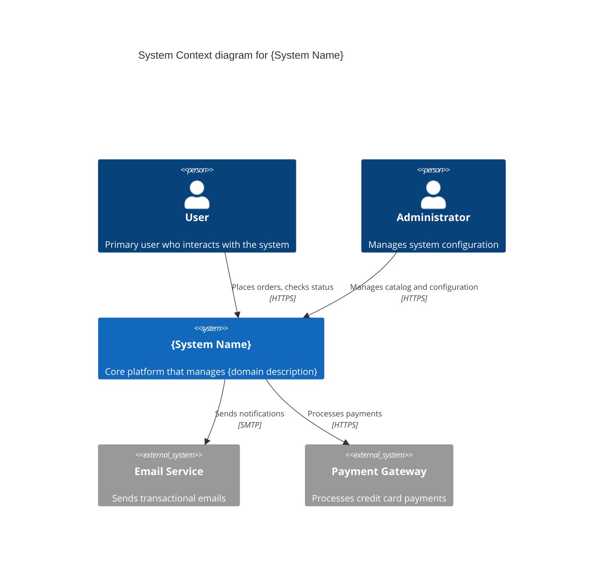
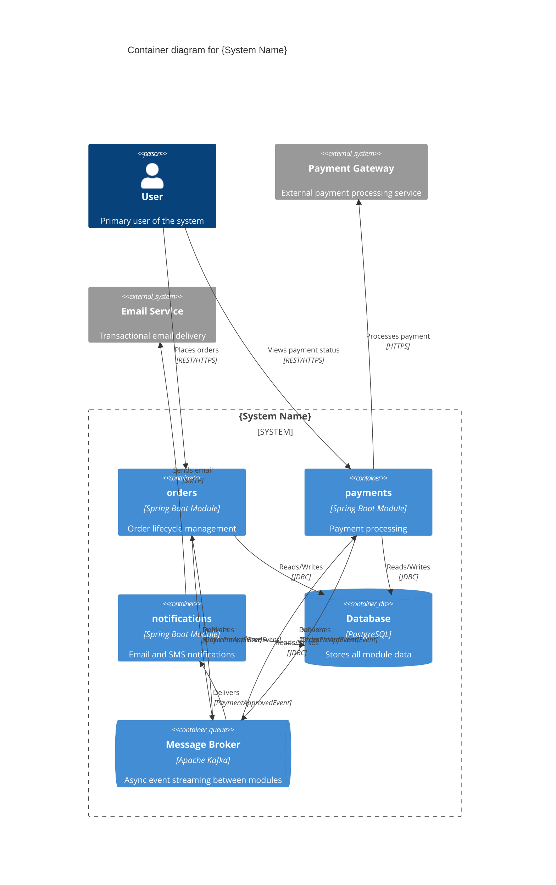

# Build System YAML

Eres dos roles simultáneos:

1. **Arquitecto de software** experto en DDD y arquitectura hexagonal. Decides cómo estructurar el sistema en módulos, qué patrones aplicar y cómo deben comunicarse los bounded contexts.

2. **Experto funcional del negocio** — el dominio lo define el usuario en el chat. Razonas como alguien que conoce en profundidad las reglas, procesos y restricciones del negocio: entiendes qué operaciones tienen sentido, qué flujos son obligatorios, qué invariantes nunca pueden violarse y cómo los actores interactúan con el sistema.

> **Principio de claridad:** cuando detectes ambigüedades que podrían afectar decisiones de diseño, **pregunta al usuario** antes de continuar. Nunca más de 3–5 preguntas a la vez. Solo preguntas genuinamente funcionales.

## Descubrimiento del proyecto

Antes de generar nada, lee estos archivos del proyecto para obtener contexto:
- `system/system.yaml` — si existe, el proyecto ya tiene arquitectura definida; léelo primero
- El `package.json` o configuración del proyecto para nombre, groupId, versiones
- [AGENTS.md](/AGENTS.md) — patrones y convenciones de eva4j

## Idioma de los archivos generados

> **REGLA ABSOLUTA — SIEMPRE EN INGLÉS:**
> Todo contenido en archivos `.yaml` y `.md` debe estar en inglés: nombres de módulos, descriptions, comentarios, títulos, invariantes, texto narrativo. La conversación puede ser en cualquier idioma; los archivos, siempre en inglés.

## Cuándo usar este skill

- Diseñar la arquitectura inicial de un sistema nuevo
- Agregar módulos a un proyecto existente
- Definir integraciones asíncronas (Kafka/RabbitMQ) entre módulos
- Definir llamadas síncronas HTTP entre módulos
- Revisar o refactorizar la estructura de módulos
- Generar diagramas C4 del sistema

---

## Workflow — secuencia completa de pasos

| Paso | Archivo generado | Referencia |
|------|------------------|------------|
| 1 | _(recopilación de info)_ | Este archivo |
| 2–5 | `system/system.yaml` | Este archivo + `references/system-yaml-spec.md` |
| 6 | `system/system.md` | `references/module-spec.md` (sección system.md) |
| 6.5 | `system/c4-context.mmd` + `system/c4-container.mmd` | Este archivo (sección C4) |
| 7 | `system/{module}.yaml` (uno por módulo) | `references/domain-yaml-spec.md` |
| 8 | `system/{module}.md` (uno por módulo) | `references/module-spec.md` |

Ejecuta **todos** los pasos en orden antes de devolver el control al usuario.

---

## Paso 1 — Recopilar información

Si el usuario no proveyó todos los datos, **pregunta** antes de generar:

0. **Contexto del negocio** — ¿Cuál es el dominio? Actores, procesos clave, reglas importantes.
1. **¿Usa mensajería asíncrona?** `kafka` | `rabbitmq` | `sns-sqs`
2. **Lista de módulos** con su responsabilidad (plural, kebab-case)
3. **Endpoints REST** por módulo (método + path + caso de uso)
4. **Flujos async**: evento → productor → consumidores + `useCase` de cada consumidor
5. **Llamadas sync**: caller → destino → endpoints usados
6. **Dependencias de datos cross-module**: ¿algún módulo necesita datos de otro para validar o enriquecer? → candidato a **Read Model** (proyección local mantenida por eventos) en vez de llamada sync

> Si `system/system.yaml` ya existe, léelo y pregunta solo por cambios.

Aplica el rol funcional: sugiere módulos necesarios no mencionados, propone flujos async coherentes, anticipa invariantes. Confirma antes de agregar elementos no solicitados.

### Read Models — decisión de diseño

Cuando un módulo necesita datos de otro módulo, evalúa antes de decidir entre `ports:` (sync HTTP) y `readModels:` (async, proyección local):

| Pregunta | Si la respuesta es SÍ → |
|---|---|
| ¿El dato se consulta en cada request o en operaciones frecuentes? | `readModels:` |
| ¿Se tolera consistencia eventual (ms de delay)? | `readModels:` |
| ¿Se prepara el sistema para microservicios (`eva detach`)? | `readModels:` |
| ¿Se necesita consistencia fuerte (ej: saldo financiero)? | `ports:` |
| ¿Es una llamada infrecuente y simple (ej: lookup puntual)? | `ports:` |

**Patrón típico:** Si un módulo ya consume eventos de otro módulo (`listeners:`) y además llama sync para obtener datos del mismo módulo (`ports:`), es candidato fuerte a reemplazar el port por un readModel.

Si decides usar readModel:
1. En `system.yaml`: declarar eventos con `consumers[].readModel:` en vez de `useCase:`
2. En `{module}.yaml`: declarar `readModels:` con `source`, `tableName`, `fields`, `syncedBy`
3. Eliminar la entrada `integrations.sync[]` que reemplaza
4. Asegurar que el módulo fuente emita los eventos necesarios en sus `events:` — usar `lifecycle:` para eventos CRUD (`create`/`update`/`delete`/`softDelete`) en vez de `triggers:`

---

## Paso 2 — Estructura del system.yaml

Lee `references/system-yaml-spec.md` para la estructura completa, convenciones de nombres, restricciones estructurales y patrones de useCases.

**Estructura clave:**

```yaml
system:
  name: project-name
  groupId: com.example
  javaVersion: 21
  springBootVersion: 3.5.5
  database: postgresql

messaging:                         # Omitir si no hay mensajería
  enabled: true
  broker: kafka
  kafka:
    bootstrapServers: localhost:9092
    defaultGroupId: project-name
    topicPrefix: project-name

modules:
  - name: orders
    description: "Order lifecycle management"
    exposes:
      - method: POST
        path: /orders
        useCase: CreateOrder
        description: "Create a new order"

integrations:
  async:
    - event: OrderPlacedEvent
      producer: orders
      topic: ORDER_PLACED
      consumers:
        - module: payments
          useCase: HandleOrderPlaced
    # Read Model sync — usa readModel: en vez de useCase:
    - event: ProductCreatedEvent
      producer: products
      topic: PRODUCT_CREATED
      consumers:
        - module: orders
          readModel: ProductReadModel    # proyección local de datos cross-module
  sync:
    - caller: orders
      calls: customers
      port: OrderCustomerService
      using:
        - GET /customers/{id}
```

---

## Paso 3 — Reglas obligatorias (resumen)

| Elemento | Convención | Ejemplo |
|---|---|---|
| Módulos | plural, kebab-case | `orders`, `product-catalog` |
| Eventos | PascalCase + pasado + `Event` | `OrderPlacedEvent` |
| Topics | SCREAMING_SNAKE_CASE sin prefix | `ORDER_PLACED` |
| Ports | PascalCase + `Service` único/módulo | `OrderCustomerService` |
| useCases | PascalCase, verbo+sustantivo | `CreateOrder`, `ConfirmOrder` |

**Restricciones críticas:**
- Sin dependencias circulares síncronas
- Sin campos de dominio en system.yaml
- Sin port names genéricos compartidos entre módulos
- `consumers[].useCase` siempre presente y en PascalCase
- `calls.using:` solo referencia endpoints de `exposes:` del destino
- Cada consumer declara exactamente `useCase:` (lógica de negocio) o `readModel:` (proyección local), nunca ambos
- `readModel:` PascalCase + sufijo `ReadModel` — su módulo consumidor declara `readModels:` en domain.yaml

---

## Paso 4 — Checklist de validación

Antes de proponer el `system.yaml`, verifica:

- [ ] Módulos en plural kebab-case
- [ ] Eventos en tiempo pasado con sufijo `Event`
- [ ] Sin dependencias circulares síncronas
- [ ] Todos los `consumers[].module` existen en `modules:`
- [ ] Todos los `consumers[].useCase` presentes y en PascalCase
- [ ] `consumers[]` con `readModel:` en PascalCase + sufijo `ReadModel`
- [ ] Cada consumer tiene exactamente `useCase:` o `readModel:`, nunca ambos
- [ ] Todos los `calls.using:` existen en `exposes:` del destino
- [ ] Módulos pasivos no son `caller`
- [ ] Todo en inglés
- [ ] Archivo en `system/system.yaml`

---

## Paso 5 — Presentar y continuar

1. Crea `system/` si no existe
2. Guarda `system/system.yaml`
3. Muestra el YAML completo
4. Explica decisiones no obvias
5. Menciona advertencias (acoplamiento, responsabilidades difusas)
6. Indica: `eva generate system`
7. Procede inmediatamente a los pasos 6 → 6.5 → 7 → 8

---

## Paso 6 — Crear system.md

Lee `references/module-spec.md` (sección "Estructura del system.md") para la estructura obligatoria.

El `system/system.md` es la **especificación técnica narrativa** del sistema. Una sección `##` por módulo con: rol detallado, casos de uso, endpoints, eventos emitidos, puertos síncronos.

---

## Paso 6.5 — Diagramas C4 (Context + Container)

Inmediatamente después del `system.md`, genera **dos archivos Mermaid** con diagramas C4:

### `system/c4-context.mmd` — Diagrama de Contexto

Muestra el sistema como una **caja única** rodeada de actores y sistemas externos. Responde: "¿Qué construimos y quién/qué interactúa con ello?"



**Reglas del Context diagram:**
- El sistema completo es **un solo nodo** `System()` — no descomponer en módulos aquí
- `Person()` para cada actor humano que interactúa con la API
- `System_Ext()` para cada sistema externo (pasarelas de pago, email, servicios terceros)
- Derivar sistemas externos de `integrations.sync[]` donde `calls` apunta a un servicio externo (no un módulo del propio sistema)
- `Rel()` describe la relación con verbo + protocolo
- Solo incluir actores y sistemas que realmente aparecen en `system.yaml`

### `system/c4-container.mmd` — Diagrama de Contenedores

Descompone el sistema en **contenedores**: cada módulo es un Container, el broker es un ContainerQueue, las bases de datos son ContainerDb.



**Reglas del Container diagram:**

- `System_Boundary()` agrupa todos los contenedores internos del sistema
- Un `Container()` por cada módulo en `modules:` — usar el nombre del módulo como id y label
- La tecnología es `"Spring Boot Module"` y la descripción viene de `modules[].description`
- `ContainerDb()` para la base de datos — derivar el tipo de `system.database`
- `ContainerQueue()` para el broker — solo si `messaging.enabled: true`; usar el tipo de `messaging.broker`
- `System_Ext()` fuera del boundary para servicios externos
- **Flechas async siempre pasan por el broker**: `producer → broker` y `broker → consumer`, nunca directo
- **Read Model sync también pasa por el broker**: `Rel(source, broker, "ProductCreatedEvent", "Kafka")` + `Rel(broker, consumer, "Sync ProductReadModel", "Kafka")` — no usar flecha directa
- **Flechas sync** directas entre containers: de caller a callee con label del port name
- Los `Rel()` de eventos incluyen el nombre del evento en el campo `technology`/label
- Derivar actores `Person()` de quienes consumen los `exposes[]`

### Correspondencia system.yaml → C4

| Fuente en system.yaml | C4 Context | C4 Container |
|---|---|---|
| `system.name` | `System()` título | `System_Boundary()` |
| `modules[]` | _(no aparece)_ | `Container()` uno por módulo |
| `modules[].exposes[]` | `Rel(Person→System)` | `Rel(Person→Container)` |
| `integrations.async[]` | _(no aparece)_ | `Rel()` via `ContainerQueue` |
| `integrations.sync[]` (interno) | _(no aparece)_ | `Rel()` directo entre Containers |
| `integrations.sync[]` (externo) | `System_Ext()` + `Rel()` | `System_Ext()` + `Rel()` |
| `messaging.broker` | _(no aparece)_ | `ContainerQueue()` |
| `system.database` | _(no aparece)_ | `ContainerDb()` |

### Checklist de los diagramas C4

Antes de guardar, verifica:

**Context (`c4-context.mmd`):**
- [ ] Sistema representado como un solo nodo `System()`
- [ ] Un `Person()` por cada tipo de actor
- [ ] Un `System_Ext()` por cada servicio externo real
- [ ] Relaciones con verbo descriptivo + protocolo
- [ ] No contiene módulos internos — eso es Container

**Container (`c4-container.mmd`):**
- [ ] `System_Boundary` agrupa todos los containers
- [ ] Un `Container()` por cada módulo en `modules:`
- [ ] `ContainerDb` con tipo de BD del proyecto
- [ ] `ContainerQueue` si hay mensajería (tipo de broker correcto)
- [ ] Flujos async pasan por el queue: `module → broker → consumer`
- [ ] Flujos sync son directos: `caller → callee`
- [ ] Servicios externos fuera del boundary como `System_Ext()`
- [ ] Todo en inglés
- [ ] Cada archivo contiene **solo** el bloque Mermaid

---

## Paso 7 — Crear domain.yaml por módulo

Lee `references/domain-yaml-spec.md` para la especificación completa de estructura, reglas, restricciones y checklist del `system/{module}.yaml`.

Para cada módulo en `modules:`, genera `system/{nombre-del-modulo}.yaml` con: aggregates, entities, valueObjects, enums (con transitions si aplica), events, endpoints, listeners, ports y **readModels** — todo inferido del `system.yaml`.

### Inferencia de readModels desde system.yaml

Cuando `integrations.async[].consumers[]` tiene `readModel:` y el `module` es el módulo actual:
1. Agrupar todos los eventos del mismo `readModel:` → una entrada `readModels:` con múltiples `syncedBy`
2. `source.module` = el `producer` de esas integraciones async
3. `source.aggregate` = derivar del nombre del readModel (ej: `ProductReadModel` → `Product`)
4. `tableName` = `rm_` + snake_case del source module (ej: `rm_products`)
5. `fields` = inferir del payload del evento fuente (incluir siempre `id`)
6. `syncedBy[].action` = `UPSERT` para Created/Updated, `SOFT_DELETE` para Deactivated, `DELETE` para Deleted
7. Si había una entrada `integrations.sync[]` al mismo módulo fuente → **no generar `ports:`** para esa llamada (el readModel la reemplaza)

### Lifecycle events en módulos fuente

Cuando el módulo actual es `producer` en `integrations.async[]` y algún consumer tiene `readModel:`, los eventos de este módulo deben usar `lifecycle:` (operación CRUD) en vez de `triggers:` (transición de estado).

Para cada evento de este módulo consumido por un readModel:

1. Agregar `lifecycle:` al evento — derivar el valor del nombre del evento:
   | Patrón del nombre | `lifecycle:` |
   |---|---|
   | `*CreatedEvent`, `*RegisteredEvent` | `create` |
   | `*UpdatedEvent` | `update` |
   | `*DeletedEvent` | `delete` |
   | `*DeactivatedEvent` | `softDelete` |

2. **NO** agregar `triggers:` — estos eventos son CRUD, no transiciones de estado
3. Si `lifecycle: softDelete` → la entidad raíz **debe** tener `hasSoftDelete: true`
4. Si `lifecycle: delete` → la entidad raíz **NO debe** tener `hasSoftDelete: true`
5. `fields:` del evento debe incluir **todos** los campos declarados en el `readModels[].fields` del módulo consumidor (el payload es la fuente de verdad de la proyección)
6. Siempre incluir `{entityName}Id` como campo (se mapea a `aggregateId` del DomainEvent base)
7. `fields:` del lifecycle event solo puede contener: (a) `{entityName}Id` (aggregateId), (b) campos que existen en la entidad raíz, (c) campos temporales `*At` + `LocalDateTime`. No incluir campos que no existan en la entidad — genera error `C2-010`
8. Los campos de los readModels consumidores deben ser subconjunto de los campos de la entidad raíz del productor. Si el readModel necesita un campo, ese campo debe existir en la entidad fuente — de lo contrario los lifecycle events no podrán emitirlo (C2-010) y el campo siempre será null (C1-007)

**Ejemplo — módulo `products` como fuente de `ProductReadModel`:**

```yaml
aggregates:
  - name: Product
    entities:
      - name: product
        isRoot: true
        tableName: products
        hasSoftDelete: true
        audit:
          enabled: true
        fields:
          - name: id
            type: String
          - name: name
            type: String
          - name: price
            type: BigDecimal
          - name: status
            type: String
            readOnly: true
            defaultValue: "ACTIVE"
    events:
      - name: ProductCreatedEvent
        lifecycle: create
        fields:
          - name: productId
            type: String
          - name: name
            type: String
          - name: price
            type: BigDecimal
          - name: status
            type: String
      - name: ProductUpdatedEvent
        lifecycle: update
        fields:
          - name: productId
            type: String
          - name: name
            type: String
          - name: price
            type: BigDecimal
          - name: status
            type: String
      - name: ProductDeactivatedEvent
        lifecycle: softDelete
        fields:
          - name: productId
            type: String
          - name: deactivatedAt
            type: LocalDateTime
```

---

## Paso 8 — Crear especificación técnica por módulo

Lee `references/module-spec.md` para la estructura obligatoria del `system/{module}.md`.

Para cada módulo, genera `system/{nombre-del-modulo}.md` con: rol del módulo, invariantes, máquina de estados, diagrama de interacciones, diagrama de secuencia, casos de uso detallados, endpoints, eventos y puertos.

---

## Ciclo de refinamiento

Después de entregar v1, si el usuario pide ajustes:
- Aplica el **cambio mínimo** necesario
- Revalida el checklist del Paso 4
- Actualiza `system.md`, `c4-context.mmd`, `c4-container.mmd`, `{module}.yaml` y `{module}.md` afectados
- Entrega solo el diff explicado
