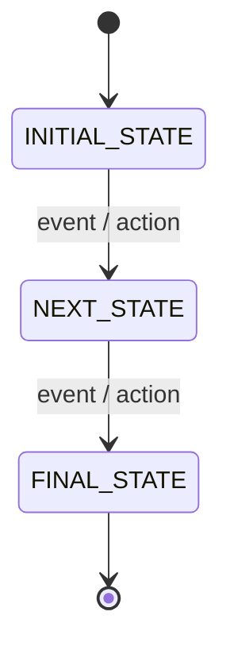
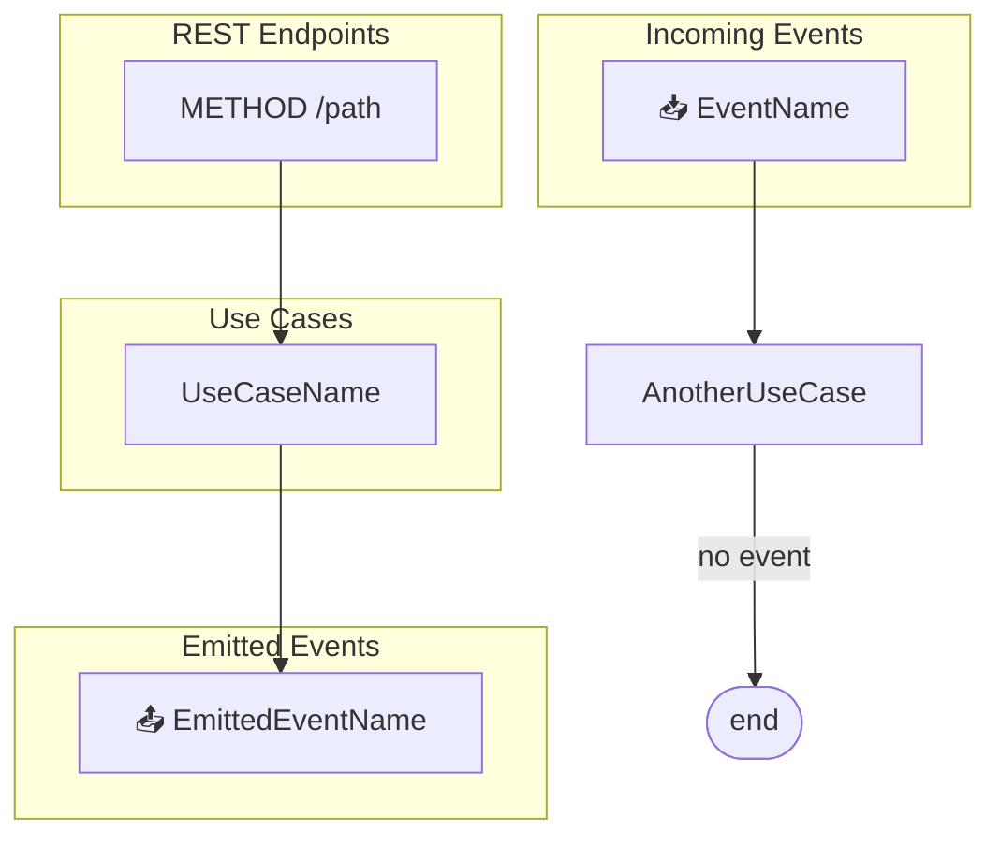
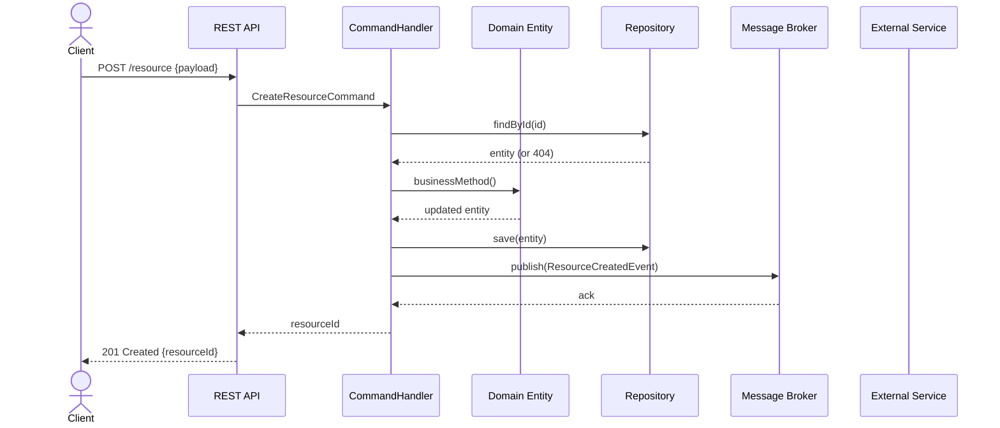
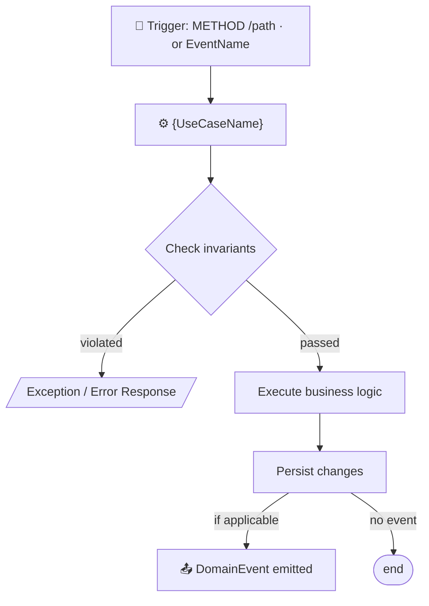
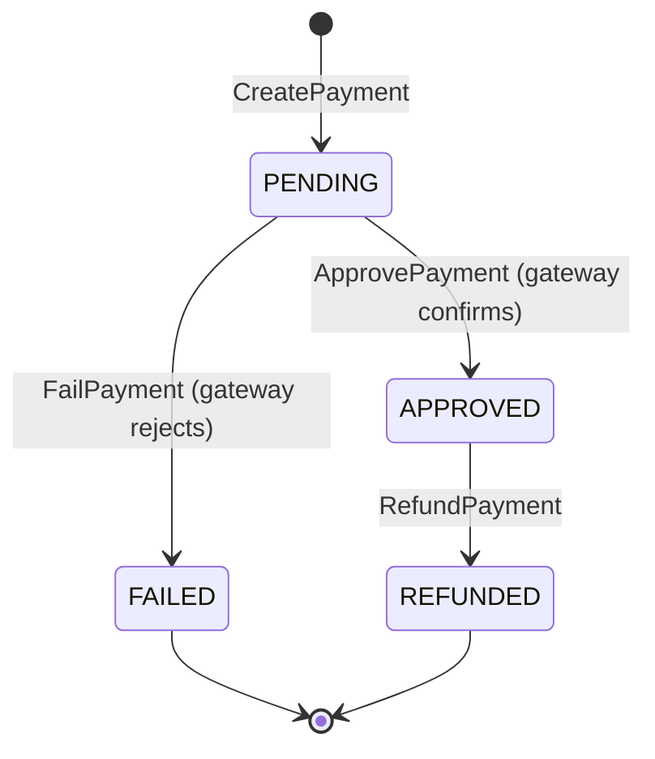
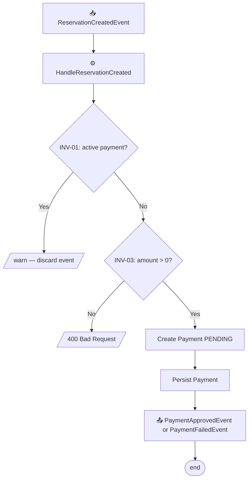

# Especificaciones de documentación del sistema

Referencia para generar `system/system.md` y `system/{module}.md`.

---

## Parte 1 — system.md (especificación narrativa global)

### Ubicación: `system/system.md`

Especificación técnica narrativa del sistema completo. Una sección `##` por cada módulo con subsecciones detalladas.

### Estructura obligatoria

```markdown
# system.md — Technical Specification

## {module-name}

### Module Role
[3–5 detailed paragraphs]
- What business problem it solves and what entities/concepts it manages
- Its exclusive responsibilities (bounded context boundaries)
- What is NOT this module's responsibility
- How it collaborates with other modules
- Business invariants it protects

### Use Cases
[One `####` section per useCase in exposes: and consumers[].useCase]

#### {UseCaseName}
**Type:** `HTTP Command` | `HTTP Query` | `Incoming Event`
**What it does:** [detailed business logic description]
**Endpoint:** [required for HTTP use cases — `METHOD /path`]
**Path params:** _(HTTP only — use table or `none`)_

| Param | Type | Required | Description |
|-------|------|----------|-------------|
| {param} | `String` | Yes | [description] |

**Query params:** _(HTTP only — use table or `none`)_

| Param | Type | Required | Default | Description |
|-------|------|----------|---------|-------------|
| {param} | `String` | No | — | [description] |

**Request body:** _(HTTP only — use table or `none`)_

| Field | Type | Required | Constraints | Description |
|-------|------|----------|-------------|-------------|
| {field} | `String` | Yes | [constraint] | [description] |

**Response body:** _(HTTP Query only — use table(s); HTTP Command must declare `none` because commands return status only)_

Single resource response:

| Field | Type | Description |
|-------|------|-------------|
| id | `String` | [description] |
| {field} | `Type` | [description] |

Paginated response wrapper:

| Field | Type | Description |
|-------|------|-------------|
| content | `Array<{Item}>` | Page content |
| totalElements | `Long` | Total records |
| page | `Integer` | Current page |
| size | `Integer` | Page size |

Paginated response item:

| Field | Type | Description |
|-------|------|-------------|
| id | `String` | [description] |
| {field} | `Type` | [description] |

**Trigger event:** [required for incoming event use cases only]
**Consumed payload:** _(Incoming Event only — use table or `none`)_

| Field | Type | Required | Description |
|-------|------|----------|-------------|
| {field} | `String` | Yes | [description] |

**Produced payload:** _(Incoming Event only — use one table per emitted event, or `none`)_

`{EventName}`

| Field | Type | Required | Description |
|-------|------|----------|-------------|
| {field} | `String` | Yes | [description] |

**Preconditions:** [required state, entities that must exist]
**Postconditions:** [system state after successful execution]
**Validations and errors:** [exception conditions and error types]
**Events emitted:** [DomainEvent name and trigger condition, or "none"]
**Operations:**
1. [Load entity / validate precondition — throw NotFoundException or 400 if invalid]
2. [External port call: {PortName}.{method}() — if applicable]
3. [Invoke domain method: entity.{method}()]
4. [Persist via repository]
5. [Emit event — if applicable]

### Exposed Endpoints
[One `####` per endpoint in exposes: as a summary-only index]

#### {METHOD} {/path}
**Use case:** `{UseCase}`
**Purpose:** [endpoint description and usage context]
**Contract location:** [reference the `#### {UseCaseName}` section where path params, query params, request body, response body, and errors are defined]

### Emitted Events
[Only if module is producer in integrations.async]

#### {EventName}
**When:** [exact business condition that fires the event]
**Payload:** [event fields with description]
**Consumers and their actions:**
- `{module}` → `{useCase}`: [what the consumer does]

### Ports (outbound sync calls)
[Only if module is caller in integrations.sync]

#### {PortName} → {target-module}
**When called:** [in which use case and under what condition]
**Endpoints used:** [METHOD /path list]
**Data obtained and how it's used:** [detailed description]

### Read Models (local projections)
[Only if module has readModels: in its domain.yaml]

#### {ReadModelName} ← {source-module}
**Purpose:** [why this projection exists — what data it provides and why sync HTTP was replaced]
**Source aggregate:** [{Aggregate} in {source-module}]
**Table:** [{tableName}]
**Projected fields:** [field list with types]
**Synced by:** [event names and actions (UPSERT/DELETE/SOFT_DELETE)]
**Consistency model:** Eventual — acceptable delay: [specify, e.g. "milliseconds"]
```

### Reglas del system.md

- **Ser SUMAMENTE específico**: estados de entidades, validaciones concretas, campos relevantes. Nunca "gestiona los datos".
- **Flujos de extremo a extremo**: si `ConfirmReservation` es disparado por `PaymentApprovedEvent`, explicarlo en ambas secciones.
- **Incluir useCases de consumers** como casos de uso del módulo consumidor.
- **Referenciar módulos por nombre**.
- **Máquinas de estado** cuando hay ciclos de vida.
- **Los casos de uso HTTP son la fuente canónica del contrato HTTP**: cada `HTTP Command` o `HTTP Query` debe declarar `Endpoint`, `Path params`, `Query params`, `Request body` y, según corresponda, `Response body` dentro de su propia sección.
- **Semántica CQRS obligatoria**: los `HTTP Command` deben declarar `Response body: none`; los `HTTP Query` deben declarar un `Response body` detallado con tipos y wrapper de paginación cuando aplique.
- **Contratos de eventos obligatorios**: cada `Incoming Event` debe declarar `Trigger event`, `Consumed payload` y `Produced payload` cuando corresponda.
- **Formato de parámetros obligatorio**: `Path params`, `Query params`, `Request body`, `Response body`, `Consumed payload` y `Produced payload` deben expresarse en tablas Markdown. Solo se permite `none` cuando la sección no aplica.
- **Exposed Endpoints es un índice/resumen**: nunca debe duplicar tablas, JSON schemas ni contratos completos ya definidos dentro de `Use Cases`.
- **Operations en casos de uso**: el campo `**Operations:**` es obligatorio en cada `#### {UseCaseName}`. Cada ítem describe un paso concreto del handler referenciando nombres reales de repositorios, ports, métodos de dominio y eventos. No usar items genéricos como "execute business logic".
- Omitir secciones no aplicables.

---

## Parte 2 — {module}.md (especificación técnica por módulo)

### Ubicación: `system/{module-name}.md`

Especificación completa e independiente para cada módulo. Un desarrollador puede leerla sin conocer el sistema completo.

### Estructura obligatoria

```markdown
# {module-name} — Technical Specification

## Module Role
[3–5 VERY detailed paragraphs]
- What business problem it solves and what entities/concepts it manages
- Exclusive responsibilities (bounded context boundaries)
- What is NOT this module's responsibility
- How it collaborates with other modules

## Invariants

> Invariants are conditions that must be **always true** within this bounded context.
> Violating an invariant is a **critical business error** that must throw an exception.

| ID | Invariant | Violation consequence |
|----|-----------|----------------------|
| INV-01 | [condition] | [exception / what it prevents] |
| INV-02 | ... | ... |

> Each use case must verify relevant invariants **before** persisting changes.

## State Machine
[ONLY if the module manages entity lifecycle — omit otherwise]



> Transition restrictions: [explain forbidden transitions — these are implicit state machine invariants]

## Interaction Diagram

> Shows the complete flow: what arrives at the module (HTTP or async event),
> which use case executes, and what event is emitted.



> Node conventions:
> - HTTP endpoints → rectangles with method and path
> - Incoming events → `📥` prefix
> - Use cases → rectangles with handler name
> - Emitted events → `📤` prefix
> - No output event → connect to FIN([end])
> - Omit ASYNC_IN if no events consumed; omit EVENTS_OUT if no events produced

## Sequence Diagram
[Chronological interactions between actors and components for main flows.
One diagram per complex flow or flow with significant branching.]



> Actor conventions:
> - `actor Client` → human users or external systems initiating the flow
> - `participant API` → module REST controller
> - `participant Handler` → CommandHandler / QueryHandler
> - `participant Domain` → domain entity (include when business logic is relevant)
> - `participant Repo` → repository abstraction
> - `participant Broker` → message broker — omit if no events
> - `participant ExtSvc` → external service via ports — use real port name
> - Sync responses: `-->>` (dotted line with arrow)
> - Async messages: `--)` (dotted line without immediate return)
> - One diagram per main flow; skip trivial read-only flows

## Use Cases
[One `###` per useCase in exposes: and consumers[].useCase]

### {UseCaseName}
**Type:** `HTTP Command` | `HTTP Query` | `Incoming Event`
**What it does:** [detailed business logic description]
**Endpoint:** [required for HTTP use cases — `METHOD /path`]
**Path params:** _(HTTP only — use table or `none`)_

| Param | Type | Required | Description |
|-------|------|----------|-------------|
| {param} | `String` | Yes | [description] |

**Query params:** _(HTTP only — use table or `none`)_

| Param | Type | Required | Default | Description |
|-------|------|----------|---------|-------------|
| {param} | `String` | No | — | [description] |

**Request body:** _(HTTP only — use table or `none`)_

| Field | Type | Required | Constraints | Description |
|-------|------|----------|-------------|-------------|
| {field} | `String` | Yes | [constraint] | [description] |

**Response body:** _(HTTP Query only — use table(s); HTTP Command must declare `none` because commands return status only)_

Single resource response:

| Field | Type | Description |
|-------|------|-------------|
| id | `String` | [description] |
| {field} | `Type` | [description] |

Paginated response wrapper:

| Field | Type | Description |
|-------|------|-------------|
| content | `Array<{Item}>` | Page content |
| totalElements | `Long` | Total records |
| page | `Integer` | Current page |
| size | `Integer` | Page size |

Paginated response item:

| Field | Type | Description |
|-------|------|-------------|
| id | `String` | [description] |
| {field} | `Type` | [description] |

**Trigger event:** [required for incoming event use cases only]
**Consumed payload:** _(Incoming Event only — use table or `none`)_

| Field | Type | Required | Description |
|-------|------|----------|-------------|
| {field} | `String` | Yes | [description] |

**Produced payload:** _(Incoming Event only — use one table per emitted event, or `none`)_

`{EventName}`

| Field | Type | Required | Description |
|-------|------|----------|-------------|
| {field} | `String` | Yes | [description] |

**Preconditions:** [valid states, entities that must exist]
**Postconditions:** [system state after successful execution]
**Invariants verified:** [ID list — e.g., INV-01, INV-03]
**Validations and errors:** [exception conditions, error type, HTTP status]
**Events emitted:** [DomainEvent name and condition, or "none"]
**Operations:**
1. [Load entity by id via {Repository}.findById() — throw NotFoundException if absent]
2. [Call {PortName}.{method}() to obtain cross-module data — if applicable]
3. [Invoke entity.{domainMethod}() — domain enforces invariants]
4. [Persist via {Repository}.save(entity)]
5. [DomainEventHandler publishes event after transaction commit — if applicable]

**Flow diagram:**

> Adapt to real flow: include relevant business nodes and branching.

## Exposed Endpoints
[Only if module has exposes: entries]

### {METHOD} {/path}
**Use case:** `{UseCase}`
**Purpose:** [description]
**Contract location:** `### {UseCase}` in the `Use Cases` section above.

## Emitted Events
[Only if module is producer in integrations.async]

### {EventName}
**When:** [exact business condition]
**Payload:** [fields with description]
**Consumers and their actions:**
- `{module}` → `{useCase}`: [what consumer does]

## Ports (outbound sync calls)
[Only if module is caller in integrations.sync]

### {PortName} → {target-module}
**When called:** [in which use case and condition]
**Endpoints used:** [METHOD /path list]
**Data obtained and how it's used:** [detailed description]

## Read Models (local projections)
[Only if module has readModels: in its domain.yaml]

### {ReadModelName} ← {source-module}
**Purpose:** [why this projection exists — what data it provides and why sync HTTP was not used]
**Source aggregate:** [{Aggregate} in {source-module}]
**Table:** [{tableName}]
**Projected fields:** [field list with types and business meaning]
**Synced by:** [event name → action, for each syncedBy entry]
**Consistency model:** Eventual — acceptable delay: [specify]
**Replaces:** [sync port name, if applicable — e.g., "Replaces OrderProductService sync call"]

### Architectural Decision — {ReadModelName}

**Context:** [{module} needs {data description} from {source-module} to {business reason}]
**Decision:** Use event-driven Local Read Model instead of sync HTTP call.
**Consequences:**
- (+) Module is fully autonomous — no runtime dependency on {source-module}
- (+) Lower latency — local DB query vs HTTP roundtrip
- (-) Eventual consistency — milliseconds delay on updates
```

---

### Reglas de los archivos de módulo

- **Todo en inglés**: títulos, secciones, descripciones, invariantes, use cases.
- **INVARIANTES obligatorias**: al menos 2–3 por módulo. Analizar unicidad, estados válidos, rangos, precondiciones de transición.
- **Diagrama de interacciones obligatorio**: todos los endpoints, eventos entrantes y read models. Sin entradas → nodo `[[passive module]]`. Read models se muestran como subgraphs separados con label `Read Models` y nodos `📦 {ReadModelName}` conectados desde eventos de sincronización.
- **Diagrama de secuencia obligatorio**: al menos un `sequenceDiagram` cubriendo el happy path. Diagramas adicionales para bifurcaciones (error, compensación). Modelar todos los actores reales.
- **Diagrama de flujo por caso de uso**: `flowchart TD` dentro de cada `### {UseCase}` con trigger, invariantes, lógica y eventos.
- **Máquina de estados condicional**: solo si hay entidades con ciclo de vida. Restricciones de transición son invariantes implícitas.
- **Referenciar invariantes** en cada caso de uso (INV-01, INV-02...).
- **Contratos HTTP obligatorios dentro del caso de uso**: cada `HTTP Command` o `HTTP Query` debe declarar `**Endpoint:**`, `**Path params:**`, `**Query params:**` y `**Request body:**` dentro de su propia sección. Esto evita separar el endpoint del caso de uso en otra sección del documento.
- **Semántica CQRS obligatoria**: los `HTTP Command` deben declarar `**Response body:** none` porque devuelven solo estado HTTP; los `HTTP Query` sí deben declarar el esquema detallado del response body.
- **Contratos de eventos obligatorios**: cada `Incoming Event` debe declarar `**Trigger event:**`, `**Consumed payload:**` y, cuando aplique, `**Produced payload:**`.
- **Formato de parámetros obligatorio**: todos los detalles de parámetros y payloads se presentan en tablas Markdown dentro del caso de uso. Solo se permite `none` cuando la sección no aplica.
- **Los contratos HTTP ricos viven en `Use Cases`**: los params, bodies, response bodies, errors y semántica command/query se describen ahí. `Exposed Endpoints` es solo un índice navegable.
- **Binding obligatorio endpoint → use case**: cada `modules[].exposes[]` del `system.yaml` debe mapear a exactamente un caso de uso de tipo `HTTP Command` o `HTTP Query` en el módulo correspondiente.
- **Binding obligatorio consumer → use case**: cada `integrations.async[].consumers[].useCase` del `system.yaml` debe mapear a exactamente un caso de uso de tipo `Incoming Event`.
- **Operations en casos de uso**: el campo `**Operations:**` es **obligatorio** en cada `### {UseCase}`. Lista los pasos del handler con nombres concretos: repositorio, port, método de dominio, evento. Sirve como contrato de implementación evaluable por revisores humanos antes de generar código.
- **No duplicar** system.md — el `.md` del módulo es la especificación completa.
- Archivos en `system/{module-name}.md`.

---

### Ejemplo condensado — `system/payments.md`

```markdown
# payments — Technical Specification

## Module Role

The `payments` module is solely responsible for the lifecycle of payments linked
to reservations. It manages communication with the external payment gateway,
records each transaction's state, and decides when to emit events that trigger
changes in other modules. It has no knowledge of reservation logic or notifications.

Confirming reservations and sending notifications are NOT this module's responsibility;
those flows are initiated by events that payments emits.

## Invariants

| ID | Invariant | Violation consequence |
|----|-----------|----------------------|
| INV-01 | Only one active payment (PENDING or APPROVED) per reservation at any time | Throws `409 Conflict` — prevents double charging |
| INV-02 | A CANCELLED or FAILED payment cannot transition to APPROVED | Throws `InvalidStateTransitionException` |
| INV-03 | Payment amount must be > 0 | Throws `400 Bad Request` |
| INV-04 | A payment can only be refunded if in APPROVED state | Throws `409 Conflict` |

## State Machine



> Restrictions: CANCELLED and FAILED are terminal states (INV-02). Only APPROVED can transition to REFUNDED (INV-04).

## Interaction Diagram


## Use Cases

### GetPayment
**Type:** `HTTP Query`
**What it does:** Returns the current payment snapshot by identifier.
**Endpoint:** `GET /payments/{id}`
**Path params:**

| Param | Type | Required | Description |
|-------|------|----------|-------------|
| id | `String` | Yes | Payment identifier |

**Query params:** none.
**Request body:** none.
**Response body:**

| Field | Type | Description |
|-------|------|-------------|
| id | `String` | Payment identifier |
| reservationId | `String` | Related reservation identifier |
| amount | `BigDecimal` | Charged amount |
| status | `PaymentStatus` | Current payment state |
| providerReference | `String?` | External gateway reference |
| approvedAt | `LocalDateTime?` | Approval timestamp |
| failedAt | `LocalDateTime?` | Failure timestamp |
| refundedAt | `LocalDateTime?` | Refund timestamp |
**Preconditions:** Payment exists.
**Postconditions:** Current payment snapshot is returned.
**Invariants verified:** INV-01, INV-03
**Validations and errors:** Unknown `id` returns `404`.
**Events emitted:** none.
**Operations:**
1. Load `Payment` by ID.
2. Map aggregate data to `PaymentResponse`.

### RefundPayment
**Type:** `HTTP Command`
**What it does:** Requests a refund for an approved payment.
**Endpoint:** `POST /payments/{id}/refund`
**Path params:**

| Param | Type | Required | Description |
|-------|------|----------|-------------|
| id | `String` | Yes | Payment identifier |

**Query params:** none.
**Request body:** none.
**Response body:** none. HTTP status only.
**Preconditions:** Payment exists and is in `APPROVED` state.
**Postconditions:** Payment moves to `REFUNDED` if the gateway accepts the request.
**Invariants verified:** INV-04
**Validations and errors:** Unknown `id` returns `404`; invalid state returns `409`.
**Events emitted:** `PaymentRefundedEvent`
**Operations:**
1. Load `Payment` by ID.
2. Call `PaymentGatewayService.refund()`.
3. Invoke `payment.refund()`.
4. Persist aggregate.
5. Publish `PaymentRefundedEvent`.

### HandleReservationCreated
**Type:** `Incoming Event`
**What it does:** Extracts `reservationId` and `totalAmount` from payload and triggers
`CreatePayment` internally to start charging automatically.
**Trigger event:** `ReservationCreatedEvent`
**Consumed payload:**

| Field | Type | Required | Description |
|-------|------|----------|-------------|
| reservationId | `String` | Yes | Upstream reservation identifier |
| totalAmount | `BigDecimal` | Yes | Amount that must be charged |

**Produced payload:**

`PaymentApprovedEvent`

| Field | Type | Required | Description |
|-------|------|----------|-------------|
| paymentId | `String` | Yes | Created payment identifier |
| reservationId | `String` | Yes | Upstream reservation identifier |
| amount | `BigDecimal` | Yes | Approved amount |
| approvedAt | `LocalDateTime` | Yes | Approval timestamp |

`PaymentFailedEvent`

| Field | Type | Required | Description |
|-------|------|----------|-------------|
| paymentId | `String` | Yes | Created payment identifier |
| reservationId | `String` | Yes | Upstream reservation identifier |
| amount | `BigDecimal` | Yes | Rejected amount |
| failedAt | `LocalDateTime` | Yes | Failure timestamp |
**Preconditions:** Payload contains valid `reservationId` and `totalAmount > 0`.
**Postconditions:** Payment created in PENDING state.
**Invariants verified:** INV-01, INV-03
**Validations and errors:** If INV-01 violated (active payment exists), discard event
and log warning. If `totalAmount ≤ 0`, throw `400`.
**Events emitted:** `PaymentApprovedEvent` or `PaymentFailedEvent` after payment processing.

**Operations:**
1. Validate the consumed payload.
2. Ensure there is no active payment for the reservation.
3. Create `Payment` aggregate in `PENDING` state.
4. Persist aggregate.
5. Publish `PaymentApprovedEvent` or `PaymentFailedEvent` after processing.

**Flow diagram:**

```
