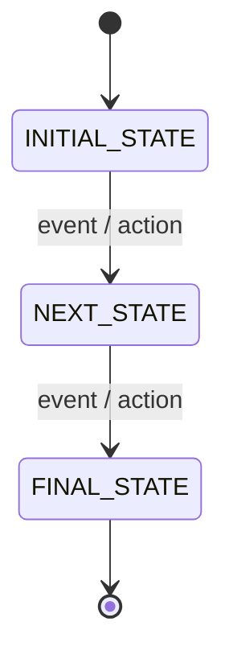
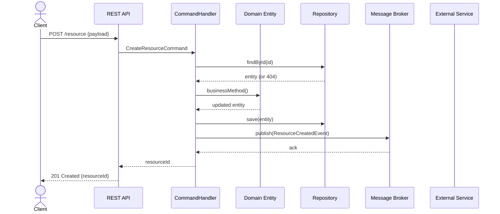
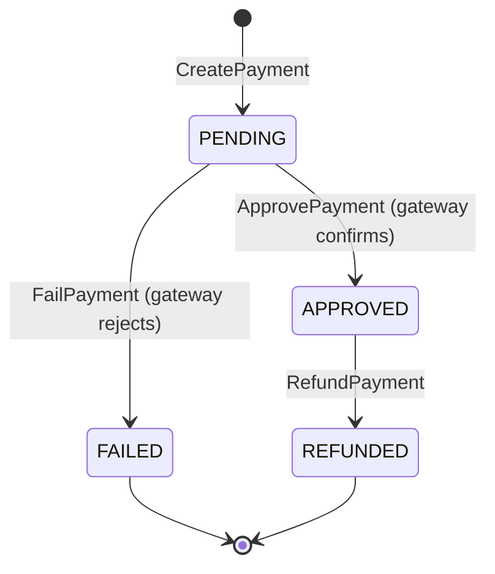
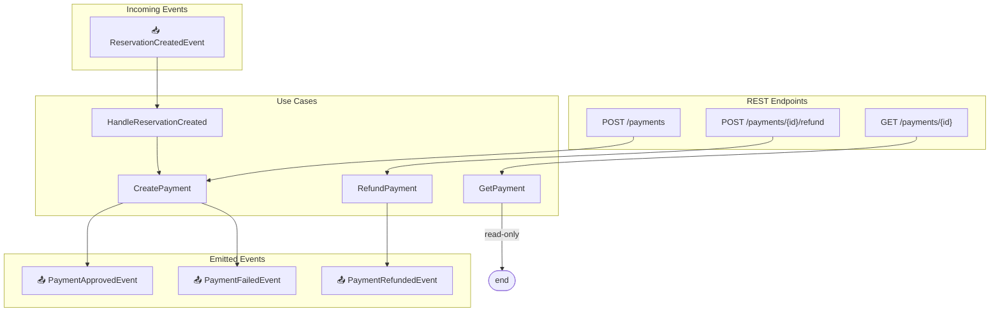
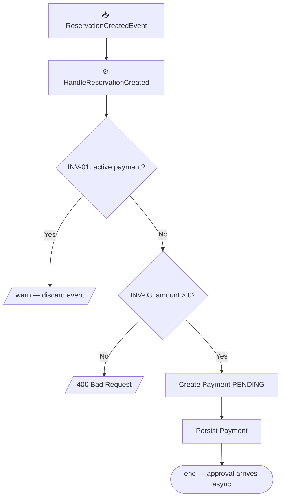

# Especificaciones de documentación del sistema

Referencia para generar `system/system.md` y `system/{module}.md`.

---

## Parte 1 — system.md (especificación narrativa global)

### Ubicación: `system/system.md`

Especificación técnica narrativa del sistema completo. Una sección `##` por cada módulo con subsecciones detalladas.

### Estructura obligatoria

```markdown
# system.md — Technical Specification

## {module-name}

### Module Role
[3–5 detailed paragraphs]
- What business problem it solves and what entities/concepts it manages
- Its exclusive responsibilities (bounded context boundaries)
- What is NOT this module's responsibility
- How it collaborates with other modules
- Business invariants it protects

### Use Cases
[One `####` section per useCase in exposes: and consumers[].useCase]

#### {UseCaseName}
**What it does:** [detailed business logic description]
**Preconditions:** [required state, entities that must exist]
**Postconditions:** [system state after successful execution]
**Validations and errors:** [exception conditions and error types]
**Events emitted:** [DomainEvent name and trigger condition, or "none"]

### Exposed Endpoints
[One `####` per endpoint in exposes:]

#### {METHOD} {/path}
**Purpose:** [endpoint description and usage context]
**Path params / Query params:** [each parameter described]
**Request body:** [expected fields, types, validation constraints]
**Response:** [returned fields and their business meaning]
**Errors:** [HTTP status codes and when they occur]

### Emitted Events
[Only if module is producer in integrations.async]

#### {EventName}
**When:** [exact business condition that fires the event]
**Payload:** [event fields with description]
**Consumers and their actions:**
- `{module}` → `{useCase}`: [what the consumer does]

### Ports (outbound sync calls)
[Only if module is caller in integrations.sync]

#### {PortName} → {target-module}
**When called:** [in which use case and under what condition]
**Endpoints used:** [METHOD /path list]
**Data obtained and how it's used:** [detailed description]
```

### Reglas del system.md

- **Ser SUMAMENTE específico**: estados de entidades, validaciones concretas, campos relevantes. Nunca "gestiona los datos".
- **Flujos de extremo a extremo**: si `ConfirmReservation` es disparado por `PaymentApprovedEvent`, explicarlo en ambas secciones.
- **Incluir useCases de consumers** como casos de uso del módulo consumidor.
- **Referenciar módulos por nombre**.
- **Máquinas de estado** cuando hay ciclos de vida.
- Omitir secciones no aplicables.

---

## Parte 2 — {module}.md (especificación técnica por módulo)

### Ubicación: `system/{module-name}.md`

Especificación completa e independiente para cada módulo. Un desarrollador puede leerla sin conocer el sistema completo.

### Estructura obligatoria

```markdown
# {module-name} — Technical Specification

## Module Role
[3–5 VERY detailed paragraphs]
- What business problem it solves and what entities/concepts it manages
- Exclusive responsibilities (bounded context boundaries)
- What is NOT this module's responsibility
- How it collaborates with other modules

## Invariants

> Invariants are conditions that must be **always true** within this bounded context.
> Violating an invariant is a **critical business error** that must throw an exception.

| ID | Invariant | Violation consequence |
|----|-----------|----------------------|
| INV-01 | [condition] | [exception / what it prevents] |
| INV-02 | ... | ... |

> Each use case must verify relevant invariants **before** persisting changes.

## State Machine
[ONLY if the module manages entity lifecycle — omit otherwise]



> Transition restrictions: [explain forbidden transitions — these are implicit state machine invariants]

## Interaction Diagram

> Shows the complete flow: what arrives at the module (HTTP or async event),
> which use case executes, and what event is emitted.


> Node conventions:
> - HTTP endpoints → rectangles with method and path
> - Incoming events → `📥` prefix
> - Use cases → rectangles with handler name
> - Emitted events → `📤` prefix
> - No output event → connect to FIN([end])
> - Omit ASYNC_IN if no events consumed; omit EVENTS_OUT if no events produced

## Sequence Diagram
[Chronological interactions between actors and components for main flows.
One diagram per complex flow or flow with significant branching.]



> Actor conventions:
> - `actor Client` → human users or external systems initiating the flow
> - `participant API` → module REST controller
> - `participant Handler` → CommandHandler / QueryHandler
> - `participant Domain` → domain entity (include when business logic is relevant)
> - `participant Repo` → repository abstraction
> - `participant Broker` → message broker — omit if no events
> - `participant ExtSvc` → external service via ports — use real port name
> - Sync responses: `-->>` (dotted line with arrow)
> - Async messages: `--)` (dotted line without immediate return)
> - One diagram per main flow; skip trivial read-only flows

## Use Cases
[One `###` per useCase in exposes: and consumers[].useCase]

### {UseCaseName}
**Type:** `HTTP` | `Incoming Event` (specify which)
**What it does:** [detailed business logic description]
**Preconditions:** [valid states, entities that must exist]
**Postconditions:** [system state after successful execution]
**Invariants verified:** [ID list — e.g., INV-01, INV-03]
**Validations and errors:** [exception conditions, error type, HTTP status]
**Events emitted:** [DomainEvent name and condition, or "none"]

**Flow diagram:**

> Adapt to real flow: include relevant business nodes and branching.

## Exposed Endpoints
[Only if module has exposes: entries]

### {METHOD} {/path}
**Use case:** `{UseCase}`
**Purpose:** [description]
**Path params / Query params:** [each parameter]
**Request body:** [fields, types, validations]
**Response:** [fields and business meaning]
**Errors:** [HTTP status codes and conditions]

## Emitted Events
[Only if module is producer in integrations.async]

### {EventName}
**When:** [exact business condition]
**Payload:** [fields with description]
**Consumers and their actions:**
- `{module}` → `{useCase}`: [what consumer does]

## Ports (outbound sync calls)
[Only if module is caller in integrations.sync]

### {PortName} → {target-module}
**When called:** [in which use case and condition]
**Endpoints used:** [METHOD /path list]
**Data obtained and how it's used:** [detailed description]
```

---

### Reglas de los archivos de módulo

- **Todo en inglés**: títulos, secciones, descripciones, invariantes, use cases.
- **INVARIANTES obligatorias**: al menos 2–3 por módulo. Analizar unicidad, estados válidos, rangos, precondiciones de transición.
- **Diagrama de interacciones obligatorio**: todos los endpoints y eventos entrantes. Sin entradas → nodo `[[passive module]]`.
- **Diagrama de secuencia obligatorio**: al menos un `sequenceDiagram` cubriendo el happy path. Diagramas adicionales para bifurcaciones (error, compensación). Modelar todos los actores reales.
- **Diagrama de flujo por caso de uso**: `flowchart TD` dentro de cada `### {UseCase}` con trigger, invariantes, lógica y eventos.
- **Máquina de estados condicional**: solo si hay entidades con ciclo de vida. Restricciones de transición son invariantes implícitas.
- **Referenciar invariantes** en cada caso de uso (INV-01, INV-02...).
- **No duplicar** system.md — el `.md` del módulo es la especificación completa.
- Archivos en `system/{module-name}.md`.

---

### Ejemplo condensado — `system/payments.md`

```markdown
# payments — Technical Specification

## Module Role

The `payments` module is solely responsible for the lifecycle of payments linked
to reservations. It manages communication with the external payment gateway,
records each transaction's state, and decides when to emit events that trigger
changes in other modules. It has no knowledge of reservation logic or notifications.

Confirming reservations and sending notifications are NOT this module's responsibility;
those flows are initiated by events that payments emits.

## Invariants

| ID | Invariant | Violation consequence |
|----|-----------|----------------------|
| INV-01 | Only one active payment (PENDING or APPROVED) per reservation at any time | Throws `409 Conflict` — prevents double charging |
| INV-02 | A CANCELLED or FAILED payment cannot transition to APPROVED | Throws `InvalidStateTransitionException` |
| INV-03 | Payment amount must be > 0 | Throws `400 Bad Request` |
| INV-04 | A payment can only be refunded if in APPROVED state | Throws `409 Conflict` |

## State Machine



> Restrictions: CANCELLED and FAILED are terminal states (INV-02). Only APPROVED can transition to REFUNDED (INV-04).

## Interaction Diagram



## Use Cases

### HandleReservationCreated
**Type:** Incoming Event (`ReservationCreatedEvent`)
**What it does:** Extracts `reservationId` and `totalAmount` from payload and triggers
`CreatePayment` internally to start charging automatically.
**Preconditions:** Payload contains valid `reservationId` and `totalAmount > 0`.
**Postconditions:** Payment created in PENDING state.
**Invariants verified:** INV-01, INV-03
**Validations and errors:** If INV-01 violated (active payment exists), discard event
and log warning. If `totalAmount ≤ 0`, throw `400`.
**Events emitted:** none directly; approval arrives asynchronously.

**Flow diagram:**

```
