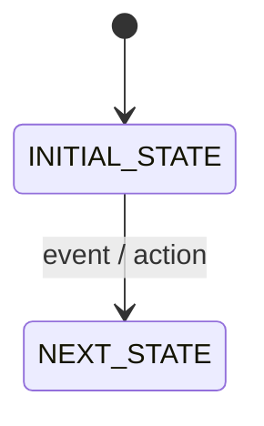
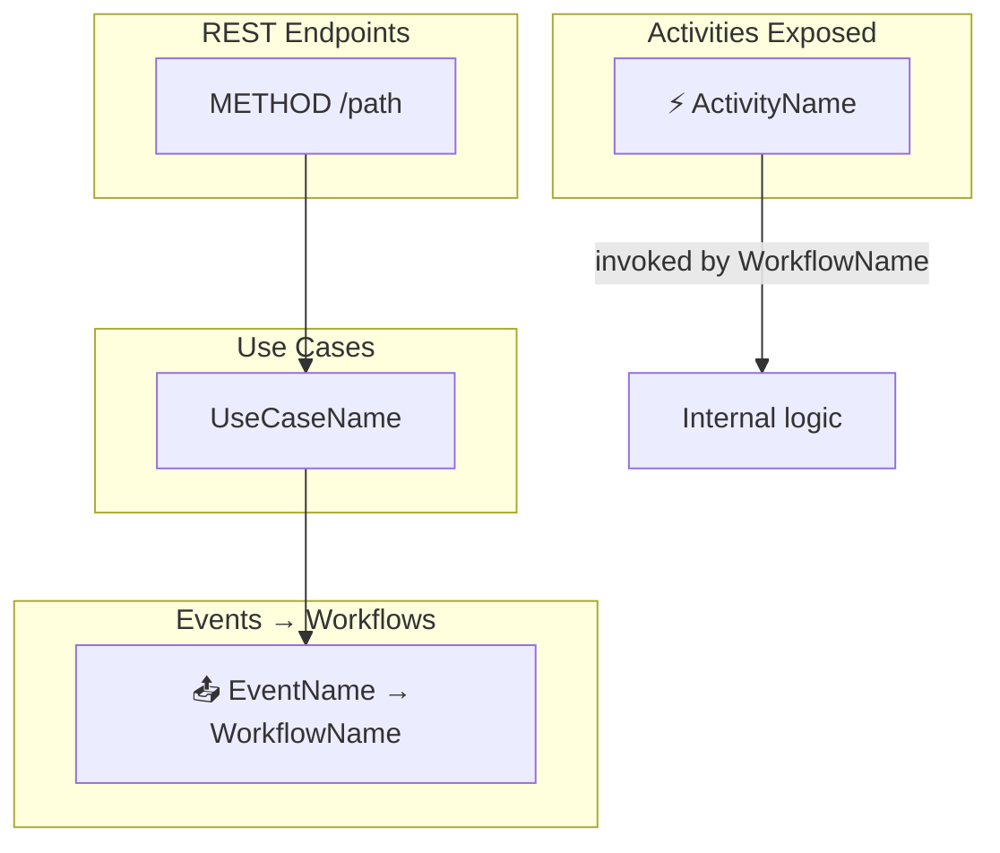
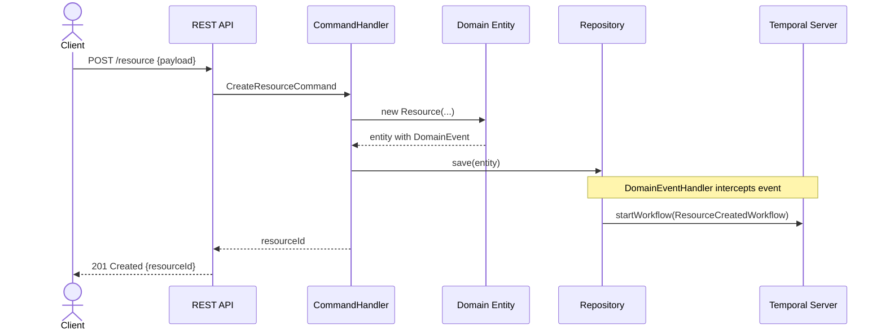
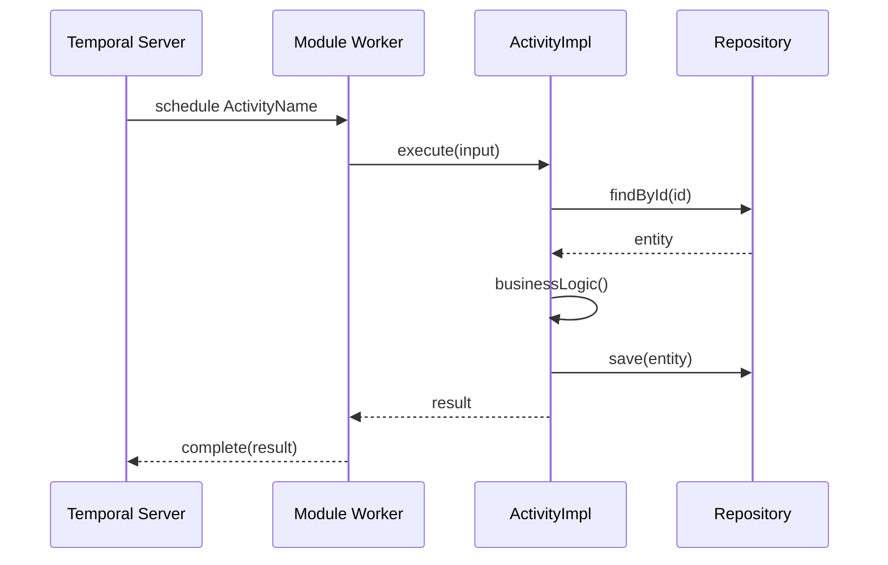
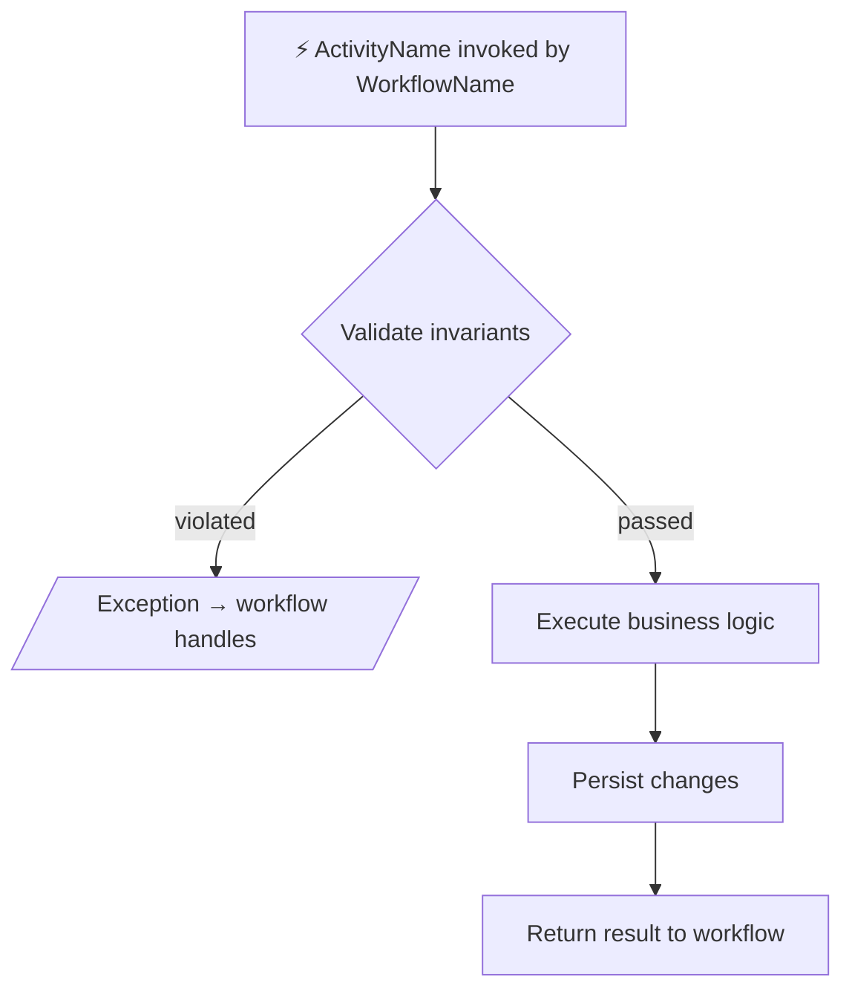

# Temporal Module Specification — Documentation Templates

Reference for generating `system/system.md` and `system/{module}.md` in a Temporal-based system.

> **PATH RULE:** All documentation files MUST be saved inside the `system/` directory (e.g., `system/system.md`, `system/orders.md`). NEVER save at the project root.

---

## Part 1 — system.md (global narrative specification)

### Location: `system/system.md`

Narrative technical specification of the complete system. One `##` section per module with detailed subsections.

### Mandatory structure

```markdown
# system.md — Technical Specification

## {module-name}

### Module Role
[3–5 detailed paragraphs]
- What business problem it solves and what entities/concepts it manages
- Its exclusive responsibilities (bounded context boundaries)
- What is NOT this module's responsibility
- How it collaborates with other modules via Temporal activities
- Business invariants it protects

### Use Cases
[One `####` section per useCase in exposes:]

#### {UseCaseName}
**What it does:** [detailed business logic description]
**Preconditions:** [required state, entities that must exist]
**Postconditions:** [system state after successful execution]
**Validations and errors:** [exception conditions and error types]
**Events emitted:** [DomainEvent name and what workflow it triggers, or "none"]
**Operations:**
1. [Load entity / validate precondition — throw NotFoundException or 400 if invalid]
2. [External port call: {PortName}.{method}() — if applicable]
3. [Invoke domain method: entity.{method}()]
4. [Persist via repository]
5. [Emit event → triggers {WorkflowName} — if applicable]

### Exposed Endpoints
[One `####` per endpoint in exposes:]

#### {METHOD} {/path}
**Purpose:** [endpoint description and usage context]
**Path params:** [param — Type — Description; omit if none]
**Query params:** [GET/DELETE only — param: Type, required/optional, default, description; omit if none]
**Request body:** [POST/PUT/PATCH only — field: Type — constraint; omit for GET/DELETE]
**Response:** [GET only — field: Type — business meaning; list endpoints include {content:[...], totalElements, page, size}]
**Errors:** [HTTP status — condition]

### Activities Exposed
[One `####` per activity declared in module's domain.yaml]

#### {ActivityName}
**Type:** `light` | `heavy`
**Task Queue:** `{MODULE}_LIGHT_TASK_QUEUE` | `{MODULE}_HEAVY_TASK_QUEUE`
**Invoked by:** [workflow name(s) from system.yaml or domain.yaml]
**Input:** [field names and types]
**Output:** [field names and types, or "void"]
**Compensation:** [{compensation activity name} or "none"]
**What it does:** [detailed description of the business operation]
**Data access:** [what this activity reads/writes in its own database]

### Workflows Triggered
[Only if module has events with notifies:]

#### {EventName} → {WorkflowName}
**When:** [exact business condition that fires the event]
**Workflow:** [{WorkflowName} — defined in system.yaml]
**Steps summary:** [brief description of what the workflow does]

### Single-Module Workflows
[Only if module has workflows: in its domain.yaml]

#### {WorkflowName}
**Trigger:** [what internal event or condition starts it]
**Task Queue:** [{QUEUE_NAME}]
**Steps:** [ordered list of activities with descriptions]
**Purpose:** [why this internal workflow exists]

### Ports (external services)
[Only if module has ports: in its domain.yaml]

#### {PortName} → {target}
**When called:** [in which activity or use case]
**Endpoints used:** [METHOD /path list]
**Data obtained and how it's used:** [detailed description]
```

### Rules for system.md

- **Be EXTREMELY specific**: entity states, concrete validations, relevant fields
- **End-to-end flows**: if `ConfirmOrder` is invoked as an activity by `PlaceOrderWorkflow`, explain it in both sections
- **Activities are the collaboration mechanism**: explain which workflows invoke each activity
- **Reference modules by name**
- **State machines** when there are lifecycles
- **Detailed endpoints**: separate path params from query params. For GETs provide the key response fields with types. For POST/PUT/PATCH list body fields with types and constraints. Never use "see request" as a response description.
- **Operations in use cases**: the `**Operations:**` field is mandatory in each `#### {UseCaseName}`. Each item describes a concrete handler step referencing real repository, port, domain method, and event names. No generic items like "execute business logic".
- Omit non-applicable sections

---

## Part 2 — {module}.md (technical specification per module)

### Location: `system/{module-name}.md`

Complete, standalone specification for each module. A developer can read it without knowing the full system.

### Mandatory structure

```markdown
# {module-name} — Technical Specification

## Module Role
[3–5 VERY detailed paragraphs]
- What business problem it solves and what entities/concepts it manages
- Exclusive responsibilities (bounded context boundaries)
- What is NOT this module's responsibility
- How it collaborates with other modules via Temporal activities
- How it is different from a broker-based architecture

## Invariants

> Invariants are conditions that must be **always true** within this bounded context.
> Violating an invariant is a **critical business error** that must throw an exception.

| ID | Invariant | Violation consequence |
|----|-----------|----------------------|
| INV-01 | [condition] | [exception / what it prevents] |

> Each use case and activity must verify relevant invariants **before** persisting.

## State Machine
[ONLY if the module manages entity lifecycle — omit otherwise]



## Interaction Diagram

> Shows: REST endpoints → use cases, activities invoked by workflows, events triggered.
> Uses Temporal-specific iconography.



> Node conventions:
> - HTTP endpoints → rectangles with method and path
> - Activities → `⚡` prefix with activity name
> - Use cases → rectangles with handler name
> - Events with workflows → `📤` prefix + event → workflow
> - Omit sections if not applicable

## Sequence Diagram
[Chronological interactions for main flows]



> For activity invocations:



## Use Cases
[One `###` per useCase in exposes:]

### {UseCaseName}
**Type:** `HTTP`
**What it does:** [detailed business logic description]
**Preconditions:** [valid states, entities that must exist]
**Postconditions:** [system state after successful execution]
**Invariants verified:** [ID list]
**Validations and errors:** [exception conditions]
**Events emitted:** [{EventName} → triggers {WorkflowName}, or "none"]
**Operations:**
1. [Load entity by id via {Repository}.findById() — throw NotFoundException if absent]
2. [Call {PortName}.{method}() to obtain cross-module data — if applicable]
3. [Invoke entity.{domainMethod}() — domain enforces invariants]
4. [Persist via {Repository}.save(entity)]
5. [DomainEventHandler publishes event → Temporal starts {WorkflowName} — if applicable]

## Activities Exposed
[One `###` per activity in activities:]

### {ActivityName}
**Type:** `light` | `heavy`
**Invoked by:** [{WorkflowName} from system.yaml or internal workflow]
**Input:** [fields with types and descriptions]
**Output:** [fields with types, or "void"]
**Compensation:** [{compensation activity} or "none — irreversible"]
**What it does:** [detailed business logic]
**Invariants verified:** [ID list]
**Operations:**
1. [Load entity by id via {Repository}.findById() — throw ApplicationFailure if absent (workflow handles)]
2. [Call {PortName}.{method}() — if applicable]
3. [Invoke entity.{domainMethod}() — domain enforces invariants]
4. [Persist via {Repository}.save(entity)]
5. [Return {OutputType} to workflow]
**Data access:** [repositories and operations performed]

**Flow diagram:**


## Exposed Endpoints
[One `###` per endpoint]

### {METHOD} {/path}
**Use case:** `{UseCase}`
**Purpose:** [description]
**Path params:** _(omit table if none)_

| Param | Type | Description |
|-------|------|-------------|
| {param} | `String` | [description] |

**Query params:** _(GET / DELETE only — omit table if none)_

| Param | Type | Required | Default | Description |
|-------|------|----------|---------|-------------|
| {param} | `String` | No | — | [description] |

**Request body:** _(POST / PUT / PATCH only — omit for GET / DELETE)_
```json
{
  "field": "String",       // required — [constraint]
  "otherField": "Integer"  // optional — [constraint]
}
```

**Response schema:** _(GET single only — omit for mutations)_
```json
{
  "id": "String",
  "field": "Type"          // [business meaning]
}
```
_(For GET list: `{ "content": [...], "totalElements": "Long", "page": "Integer", "size": "Integer" }`)_

**Errors:**

| Status | Condition |
|--------|-----------|
| 404 | [entity] not found |
| 400 | [validation failure] |
| 409 | [invariant violated] |

## Single-Module Workflows
[Only if workflows: in domain.yaml]

### {WorkflowName}
**Trigger:** [internal event or condition]
**Task Queue:** [{QUEUE_NAME}]
**Purpose:** [why this internal workflow exists]
**Steps:**
1. [Step description]
2. [Step description]

## Ports (External Services)
[Only if ports: in domain.yaml]

### {PortName} → {target}
**When called:** [in which activity]
**Endpoints used:** [METHOD /path list]
**Data obtained and how it's used:** [description]
```

---

### Rules for module specifications

- **All in English**: titles, sections, descriptions, invariants, use cases.
- **MANDATORY invariants**: at least 2–3 per module. Analyze uniqueness, valid states, ranges, transition preconditions.
- **MANDATORY interaction diagram**: all endpoints, activities, and events.
- **MANDATORY sequence diagram**: at least one covering the happy path. Additional for branching (error, compensation).
- **Flow diagram per use case and activity**: `flowchart TD` with trigger, invariants, logic, and output.
- **State machine**: only if entities have lifecycle. Transition restrictions are implicit invariants.
- **Reference invariants** in each use case and activity (INV-01, INV-02...).
- **Endpoints with rich contracts**: for each endpoint, separate path params, query params, body, and response into distinct blocks. Use real domain field names and types — never generic placeholders. GET endpoints must include the JSON response schema; POST/PUT/PATCH must include the JSON body. List endpoints include pagination wrapper `{ content, totalElements, page, size }`.
- **Operations in use cases and activities**: the `**Operations:**` field is **mandatory** in each `### {UseCase}` and `### {ActivityName}`. Lists the handler/activity steps with concrete names: repository, port, domain method, event, and workflow. Acts as an evaluable implementation specification for human reviewers before code generation.
- Files in `system/{module-name}.md`.
